[English](README.md)

[github原始仓库https://github.com/jaredtao/TaoQuick](https://github.com/jaredtao/TaoQuick)

[gitee镜像仓库https://gitee.com/jaredtao/TaoQuick](https://gitee.com/jaredtao/TaoQuick)

-------------------------------------------------------------

# 目录

- [目录](#目录)
- [TaoQuick](#taoquick)
- [徽章预览](#徽章预览)
  - [项目](#项目)
  - [Qt 官方商城](#qt-官方商城)
  - [编译](#编译)
  - [发布](#发布)
  - [仓库状态](#仓库状态)
  - [Issue](#issue)
  - [其它状态](#其它状态)
- [部分效果预览](#部分效果预览)
  - [主页](#主页)
  - [换皮肤](#换皮肤)
  - [多语言](#多语言)
  - [各种按钮组件](#各种按钮组件)
  - [数据输入组件](#数据输入组件)
  - [表格组件](#表格组件)
  - [矩形框组件](#矩形框组件)
  - [用户向导](#用户向导)
  - [动画特效-箭头流动](#动画特效-箭头流动)
  - [动画特效-跟上节奏](#动画特效-跟上节奏)
  - [ShaderToy-蜗牛](#shadertoy-蜗牛)
  - [ShaderToy-超级玛丽](#shadertoy-超级玛丽)
- [开发环境](#开发环境)
- [项目结构](#项目结构)
- [核心库 TaoQuick](#核心库-taoquick)
- [使用核心库TaoQuick](#使用核心库taoquick)
  - [获取代码](#获取代码)
  - [qmake用法](#qmake用法)
  - [cmake用法](#cmake用法)
- [联系作者](#联系作者)
- [寻找同道中人](#寻找同道中人)
- [赞助](#赞助)
- [赞助列表](#赞助列表)
  
# TaoQuick

这是一个QtQuick/Qml组件库，集成了常用的QtQuick组件，并做了适当的属性封装、功能扩展，以方便开发Qml程序。

实现原理可以参考《玩转Qml》系列教程，以下网站都有收录:

[涛哥的博客](https://jaredtao.github.io)

[涛哥的博客-国内镜像](https://jaredtao.gitee.io)


# 徽章预览

## 项目

|[最佳实践计划][CII-link]|[许可][license-link]|
|:--:|:--:|
|![CII-badge]|![license-badge]|

[CII-badge]: https://bestpractices.coreinfrastructure.org/projects/3060/badge
[CII-link]: https://bestpractices.coreinfrastructure.org/projects/3060

[license-link]: https://github.com/jaredtao/TaoQuick/blob/master/LICENSE "LICENSE"
[license-badge]: https://img.shields.io/badge/license-MIT-blue.svg "MIT"

## Qt 官方商城

TaoQuick项目已同步在Qt官方商城上架

https://marketplace.qt.io/collections/newest/products/taoquick

## 编译

| [Windows][win-link]| [Ubuntu][ubuntu-link]|[MacOS][macos-link]|[Android][android-link]|[IOS][ios-link]|
|---------------|---------------|-----------------|-----------------|----------------|
| ![win-badge]  | ![ubuntu-badge]      | ![macos-badge] |![android-badge]   |![ios-badge]   |


[win-link]: https://github.com/JaredTao/TaoQuick/actions?query=workflow%3AWindows "WindowsAction"
[win-badge]: https://github.com/JaredTao/TaoQuick/workflows/Windows/badge.svg  "Windows"

[ubuntu-link]: https://github.com/JaredTao/TaoQuick/actions?query=workflow%3AUbuntu "UbuntuAction"
[ubuntu-badge]: https://github.com/JaredTao/TaoQuick/workflows/Ubuntu/badge.svg "Ubuntu"

[macos-link]: https://github.com/JaredTao/TaoQuick/actions?query=workflow%3AMacOS "MacOSAction"
[macos-badge]: https://github.com/JaredTao/TaoQuick/workflows/MacOS/badge.svg "MacOS"

[android-link]: https://github.com/JaredTao/TaoQuick/actions?query=workflow%3AAndroid "AndroidAction"
[android-badge]: https://github.com/JaredTao/TaoQuick/workflows/Android/badge.svg "Android"

[ios-link]: https://github.com/JaredTao/TaoQuick/actions?query=workflow%3AIOS "IOSAction"
[ios-badge]: https://github.com/JaredTao/TaoQuick/workflows/IOS/badge.svg "IOS"

## 发布

|[已发布][release-link]|[下载][download-link]|下载次数|
|:--:|:--:|:--:|
|![release-badge] |![download-badge]|![download-latest]|

[release-link]: https://github.com/jaredtao/TaoQuick/releases "Release status"
[release-badge]: https://img.shields.io/github/release/jaredtao/TaoQuick.svg?style=flat-square "Release status"
[download-link]: https://github.com/jaredtao/TaoQuick/releases/latest "Download status"
[download-badge]: https://img.shields.io/github/downloads/jaredtao/TaoQuick/total.svg "Download status"
[download-latest]: https://img.shields.io/github/downloads/jaredtao/TaoQuick/latest/total.svg "latest status"

## 仓库状态

|最新标签|用到的编程语言数量|用最多的编程语言|代码大小|仓库大小|
|:--: |:--: |:--:|:--:|:--:|
|![tag-latest]|![languanges]|![taolanguage]|![code-size]|![repo-size]|

[languanges]: https://img.shields.io/github/languages/count/jaredtao/taoquick.svg "language count"
[taolanguage]: https://img.shields.io/github/languages/top/jaredtao/taoquick.svg "top language"
[code-size]: https://img.shields.io/github/languages/code-size/jaredtao/taoquick.svg "code size"
[repo-size]: https://img.shields.io/github/repo-size/jaredtao/taoquick.svg "repo-size"
[tag-latest]: https://img.shields.io/github/tag/jaredtao/taoquick.svg

## Issue
|[Issues][issues-link]|关掉的issue|pull请求|关掉的pull|
|:--:|:--:|:--:|:--:|
|![issuse-badge]|![issue-closed]|![pull-request]|![pull-closed]|

[issues-link]: https://github.com/jaredtao/TaoQuick/issues 
[issuse-badge]: https://img.shields.io/github/issues/jaredtao/taoquick.svg?style=popout 
[issue-closed]: https://img.shields.io/github/issues-closed/jaredtao/taoquick.svg
[pull-request]: https://img.shields.io/github/issues-pr/jaredtao/taoquick.svg
[pull-closed]: https://img.shields.io/github/issues-pr-closed/jaredtao/taoquick.svg

## 其它状态

|提交频率|最后一次提交|发布时间|forks|stars|
|:--:|:--:|:--:|:--:|:--:|
|![commit-active]|![commit-latest]|![release-date]|![forks-badge]|![stars-badge]|

[forks-badge]: https://img.shields.io/github/forks/jaredtao/taoquick.svg "forks"
[stars-badge]: https://img.shields.io/github/stars/jaredtao/taoquick.svg "stars"
[commit-active]: https://img.shields.io/github/commit-activity/w/jaredtao/taoquick.svg
[commit-latest]: https://img.shields.io/github/last-commit/jaredtao/taoquick.svg
[release-date]: https://img.shields.io/github/release-date/jaredtao/taoquick.svg


# 部分效果预览

## 主页

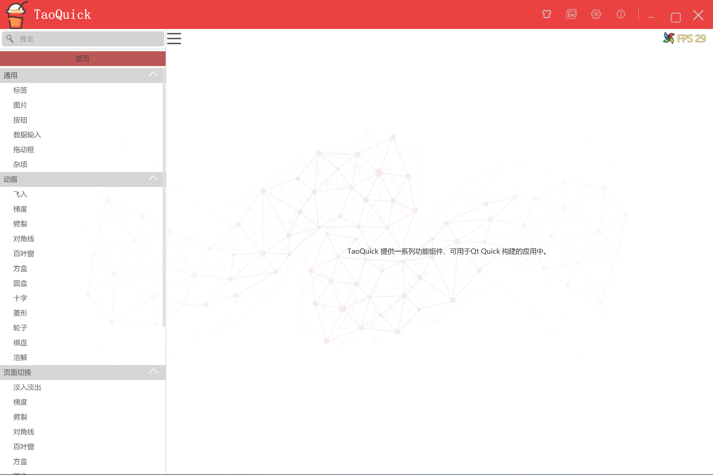

## 换皮肤

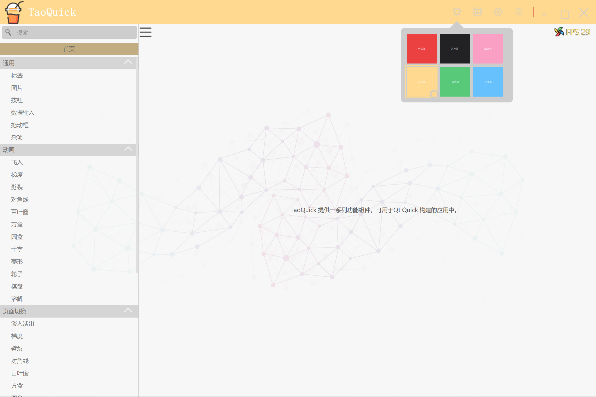

## 多语言

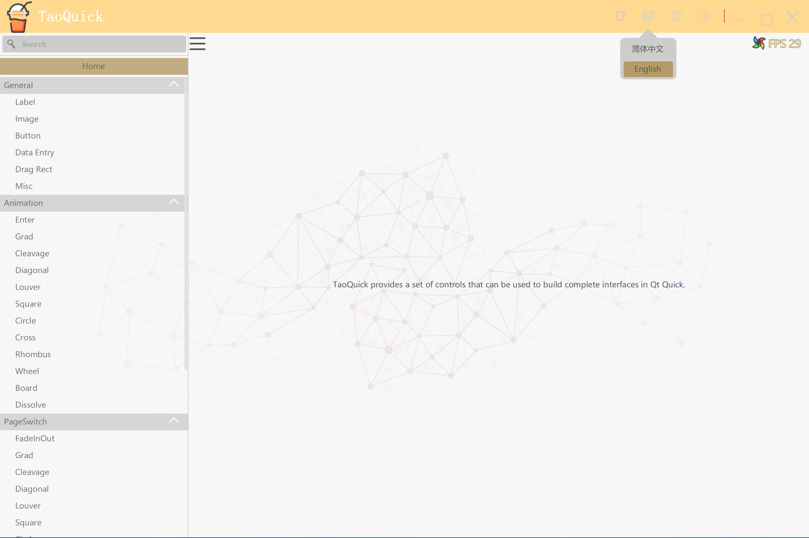

## 各种按钮组件

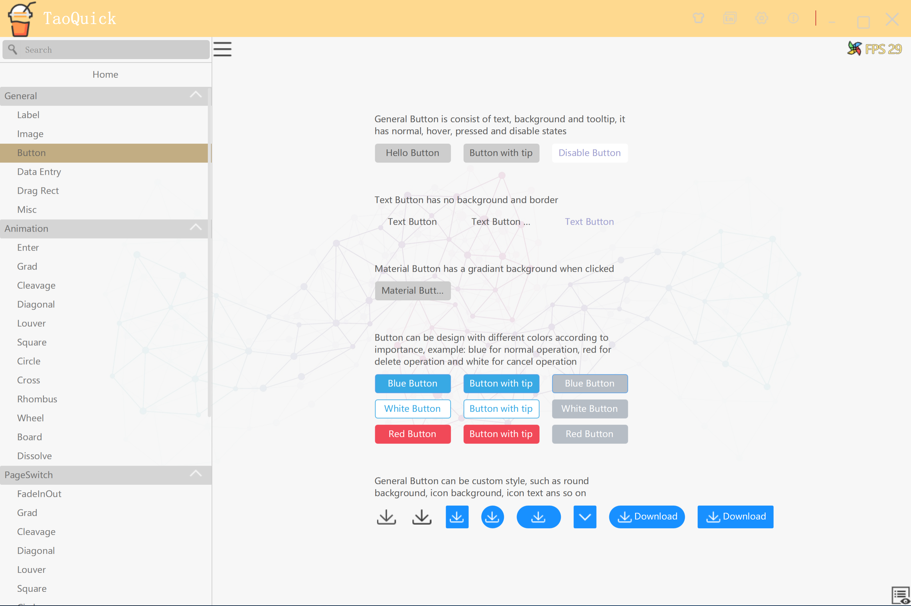

## 数据输入组件

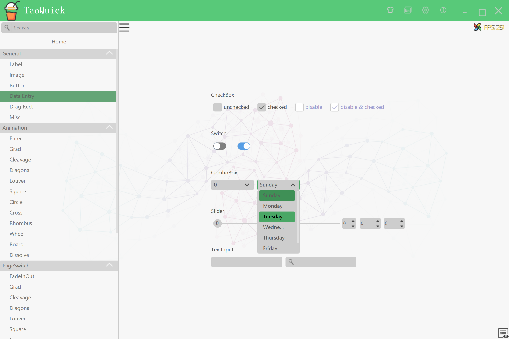

## 表格组件

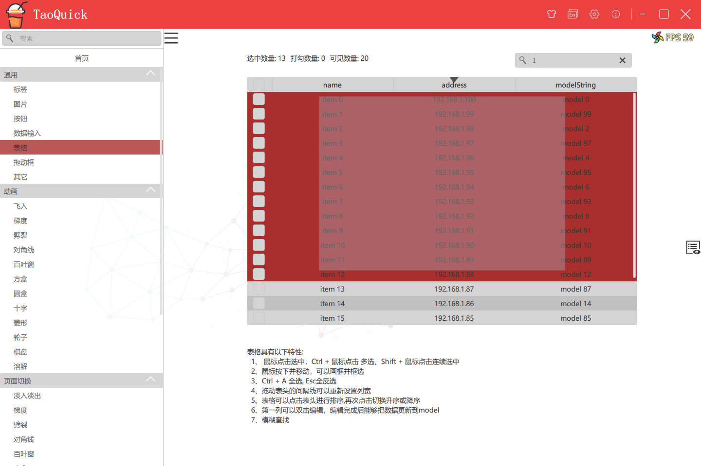

## 矩形框组件

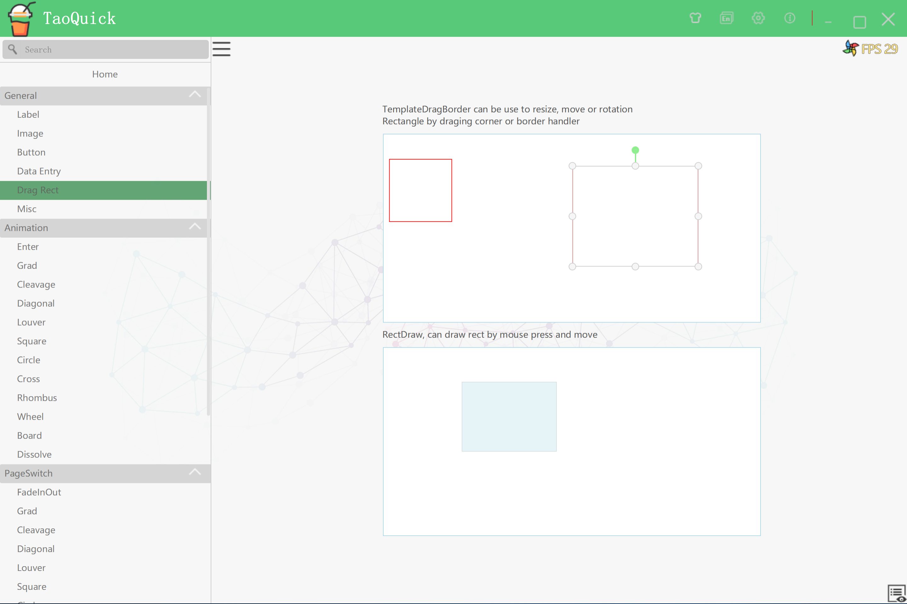

## 用户向导

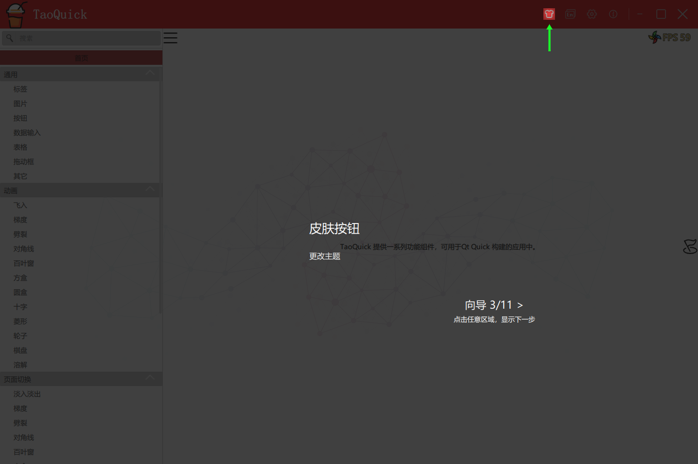
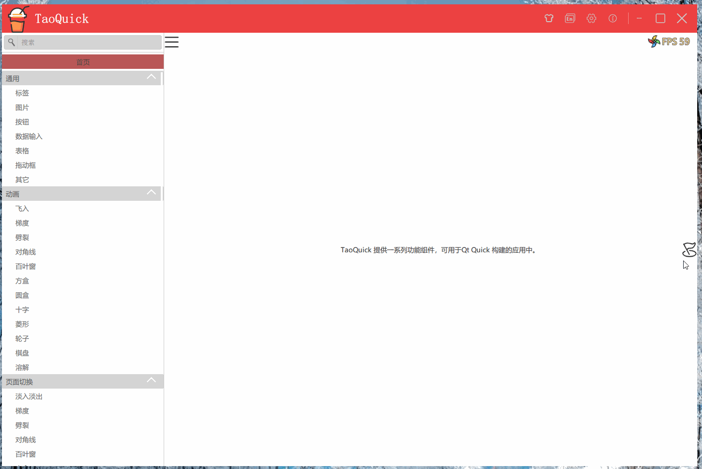

## 动画特效-箭头流动

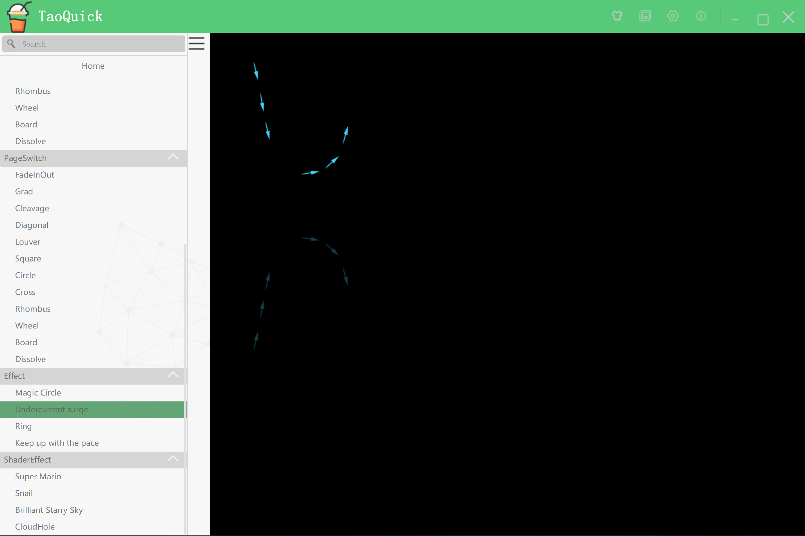

## 动画特效-跟上节奏

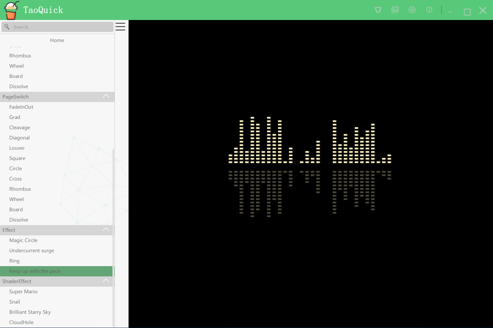


## ShaderToy-蜗牛

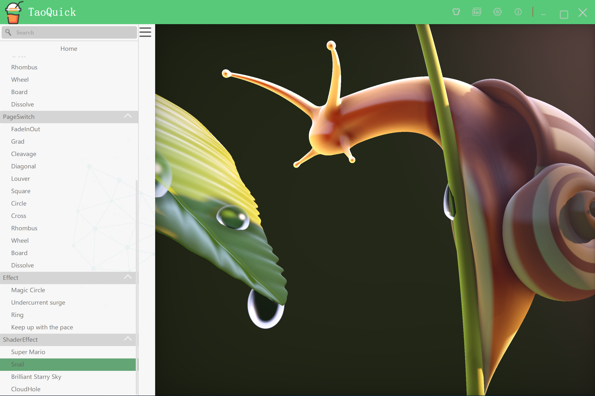

## ShaderToy-超级玛丽

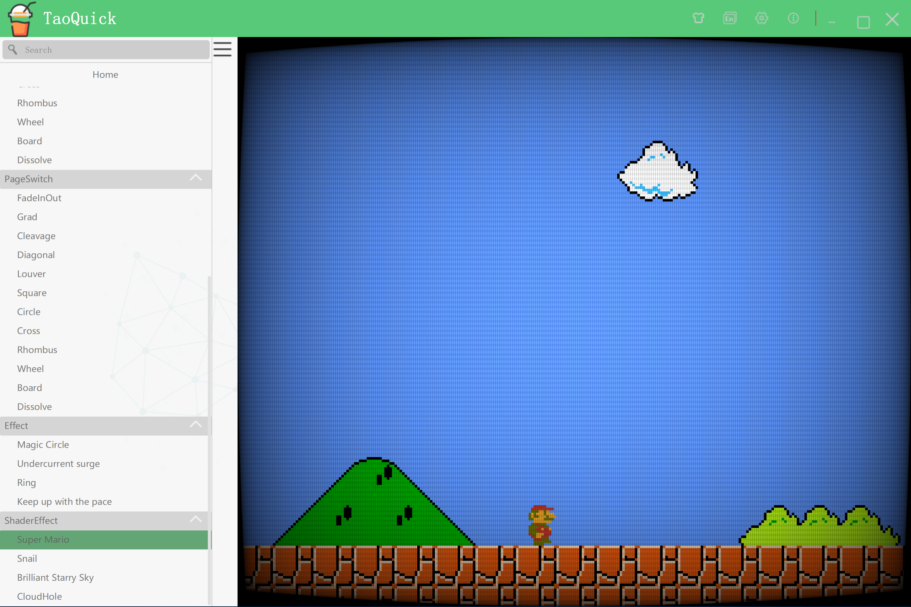


# 开发环境

* Qt 5.9.0 以上

* 已兼容Qt5.15

# 项目结构

项目结构如下

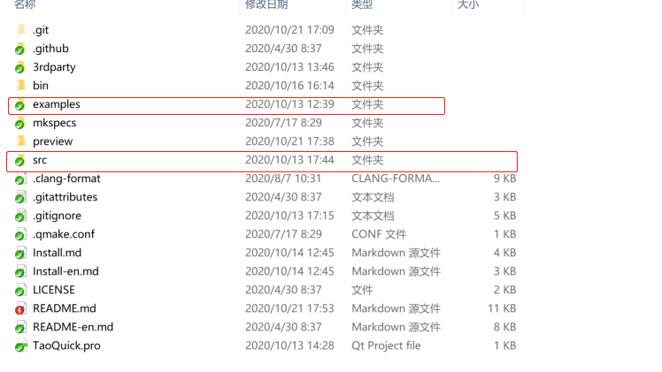

各目录说明如下表：
|目录|说明|备注|
|----|----|----|
|src|TaoQuick核心库|主要是qml代码和图片资源,以及designer支持相关的配置和脚本,不包含c++代码|
|exampes|各种示例程序|演示如何使用TaoQuick核心库,其中TaoQuickShow比较全面地展示TaoQuick的各项功能|
|3rdparty|第三方库||
|mkspecs|qmake功能的扩展||
|.github|github-actions配置|持续集成相关配置，用于自动化构建、发布|

# 核心库 TaoQuick

核心库目录为

src/TaoQuick/imports/TaoQuick/Qml

核心库结构如下

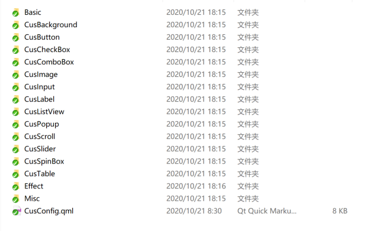

为了避免与Qt默认组件混淆，组件名称全部以Cus开头 (Custom的缩写)

CusConfig是核心库的全局配置,主要包括字体、颜色等,所有组件都按照此配置显示

其它各目录说明如下表：

|目录|说明|备注|
|----|----|----|
|Basic|基础的组件，诸如文本、悬浮提示等|用于统一整个工程中的基础组件，方便在工程变的庞大时，做全局替换|
|CusBackground|一个简单的背景框|一般放在程序的最开始，用来吸收空白区域的鼠标焦点|
|CusButton|按钮|已封装一部分经常用到的按钮，也可以二次定制各种效果|
|CusCheckBox|勾选||
|CusComboBox|下拉框||
|CusImage|基础的图像||
|CusInput|输入框||
|CusLabel|文本标签||
|CusListView|列表|简单的定制了滚动条|
|CusPopup|弹出框||
|CusScroll|滚动条||
|CusSlider|可拖动进度条||
|CusSpinBox|调节框||
|CusTable|表格|需要配合特定的C++ model使用,支持以行为单位的选中、打勾、鼠标框选、反选、连选、全选等|
|Effect|特效|动画、页面切换效果、ShaderToy等|
|Misc|其它杂项||

# 使用核心库TaoQuick 


详细的使用方法，可以阅读 [入门指南](入门指南.md)

## qmake用法

使用核心库，只需要在项目中导入'.pri'文件，并将qml路径加入到QmlEngine即可。

TaoQuick组件将以本地文件或qrc资源的方式被引用。

此种用法, 与Qml模块、Qml C++插件等方式相比，有以下优势:

* 导入pri后, 不需要额外编译、生成dll或插件

* 发布程序时不需要额外拷贝资源

* 导入pri后, Qt Creater即可支持TaoQuick的Qml代码高亮、双击跳转

* 导入pri后，在Qml中导入模块(import TaoQuick 1.0),即可在Qt Creater 的 designer模式中，通过拖拽使用TaoQuick组件、可视化开发UI (原理: 通过脚本生成designer需要的metainfo)

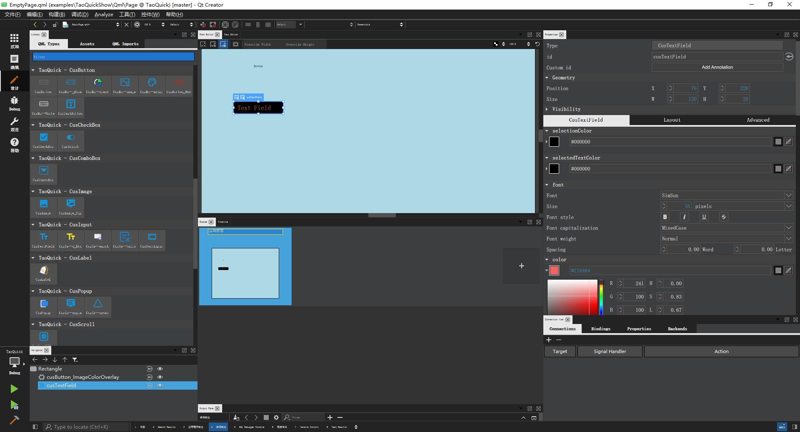

具体使用步骤：

1. 将src/TaoQuick文件夹拷贝到你的项目中，任意位置

2. 在你的项目pro文件中,导入对应的TaoQuick文件夹中的pri文件即可

```qmake
include(TaoQuick/TaoQuick.pri)
```

或者

```qmake
include(src/TaoQuick/imports/imports.pri)
```

都可以,只要路径对应到实际的文件即可

(说明：此pri文件会定义两个宏：TaoQuickImportPath 和 TaoQuickImagePath。

debug模式都以本地文件的方式使用，release模型则以qrc资源文件的方式使用)

3. 在CPP代码中，增加导入路径。
   
   需要在QmlEngine加载source之前，增加importPath，并把imagePath设置为上下文。

   如果主窗口是由QQuickView加载的，则：
   
```C++
    view.engine()->addImportPath(TaoQuickImportPath);
    view.rootContext()->setContextProperty("taoQuickImagePath", TaoQuickImagePath);
```

   如果主窗口是由QQmlEngine加载的，则:

```C++
    engine.addImportPath(TaoQuickImportPath);
    engine.rootContext()->setContextProperty("taoQuickImagePath", TaoQuickImagePath);
```

## cmake用法

详细的使用方法，可以阅读 [入门指南](入门指南.md)


TaoQuick 0.5.0以后的版本，增加了cmake支持。

原理和qmake一样，只不过换成了cmake的语法规则。

用法如下：

1. 将src/TaoQuick文件夹拷贝到你的项目中，任意位置

2. 将cmake/TaoQuick.cmake文件拷贝到你的项目中，任意位置，并且

 确保TaoQuick.cmake文件中，第一行的TaoQuickPath指向正确的TaoQuick路径

3. 在你的项目CMakeLists.txt文件中,导入对应的TaoQuick.cmake

需要先增加cmake扩展路径

```cmake
  SET(CMAKE_MODULE_PATH ${CMAKE_CURRENT_SOURCE_DIR}/cmake)
```
加载好扩展路径，就可以用incude指令导入taoQuick.cmake了

```cmake
include(taoQuick)
```

说明：taoQuick.cmake会定义两个宏：TaoQuickImportPath 和 TaoQuickImagePath。

debug模式以本地文件的方式使用，release模型则以qrc资源文件的方式使用, 将qrc文件路径定义在了宏TaoQuickRes中。

因此release模式,要在add_executable中增加TaoQuickRes, 例如

```cmake
if (CMAKE_BUILD_TYPE MATCHES "Release")
    add_executable(MyApp ${someSource} ${TaoQuickRes})
else()
    add_executable(MyApp ${someSource})
endif()
```


4. 在CPP代码中，增加导入路径。
   
   需要在QmlEngine加载source之前，增加importPath，并把imagePath设置为上下文。

   如果主窗口是由QQuickView加载的，则：
   
```C++
    view.engine()->addImportPath(TaoQuickImportPath);
    view.rootContext()->setContextProperty("taoQuickImagePath", TaoQuickImagePath);
```

   如果主窗口是由QQmlEngine加载的，则:

```C++
    engine.addImportPath(TaoQuickImportPath);
    engine.rootContext()->setContextProperty("taoQuickImagePath", TaoQuickImagePath);
```


***

# 联系作者

作者：武威的涛哥

欢迎联系我，乐于提供技术咨询服务，可洽谈技术支持、商业合作。

微信:  xsd2410421 

QQ: 759378563

邮箱:  jared2020@163.com            


*****
# 寻找同道中人

欢迎加入涛哥的QQ群: Qt进阶之路 

此群是高质量群，Qt界大佬众多，不灌水闲聊，日常交流技术、分享书籍、帮助解决实际问题。

1群：734623697

2群：342341405


******

# 赞助


 觉得分享的内容还不错, 就请作者喝杯奶茶吧~~


# 赞助列表

感谢以下网友的赞助与支持(排名不分先后)：

hxhlb (花心胡萝卜工作室)

咸鱼猴

Qt侠-刘典武

一去、二三里

大樹

丝绸-郑天佐

寒山-居士

小风电子

Qt君

海盗船

雨田哥

游龙

Rj

重庆-胡某某

Ivy

孙十一少

田宇

power

敢敢

扣脚翁

白菜豆腐

甜不辣

Mr.Hu

秾芳教主

焖哥

蓝色幻想

Martin Zuo

windsmoon

小手冰凉

永远=没有终点

我是王大狗

米粒旅行

...
