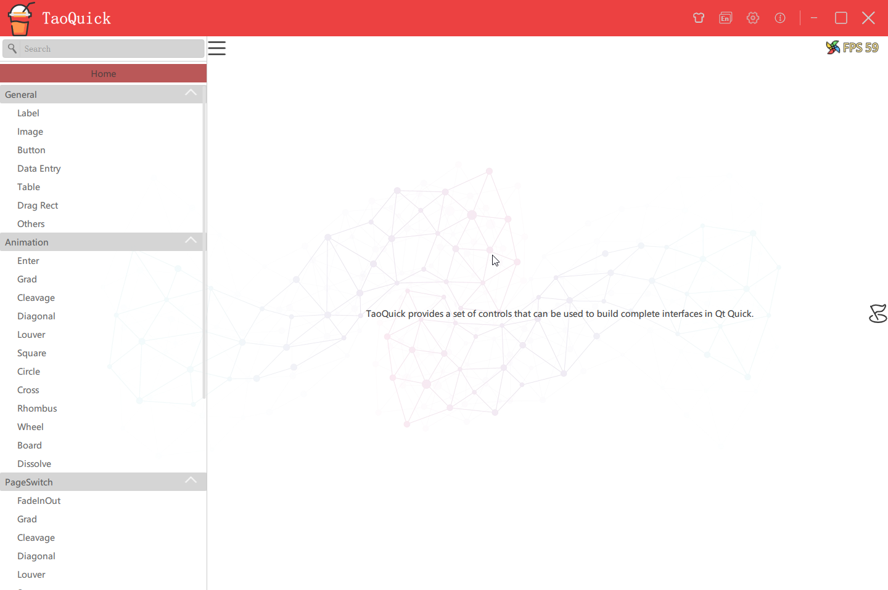
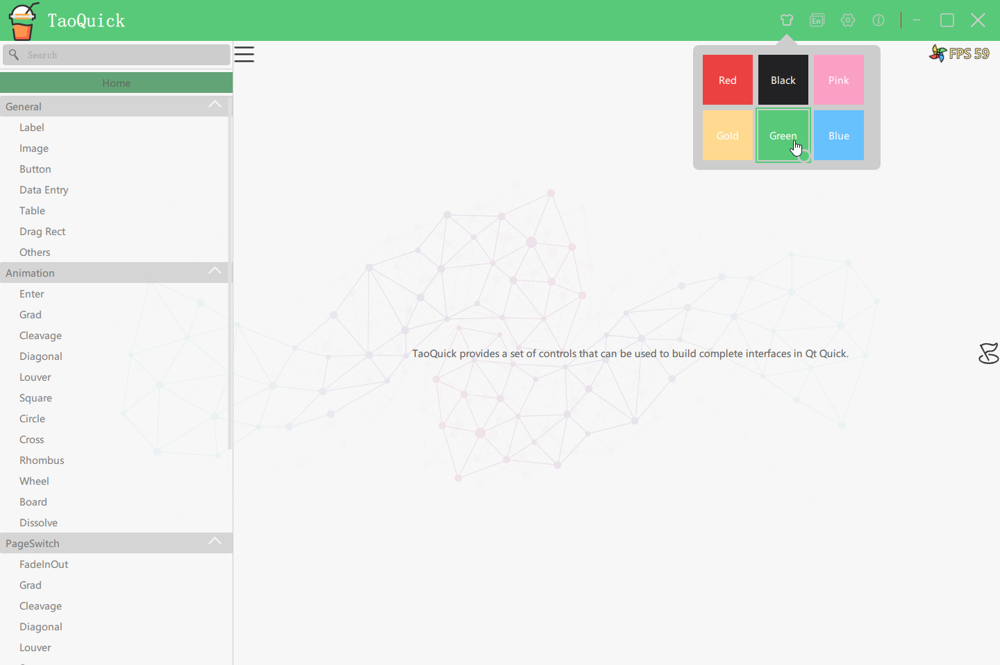
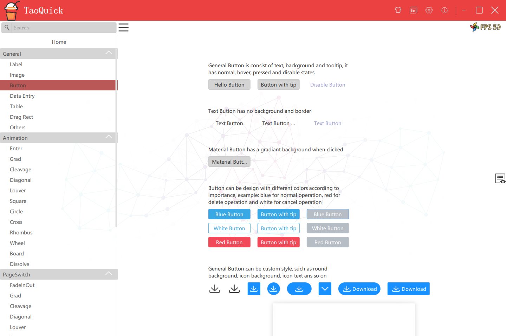
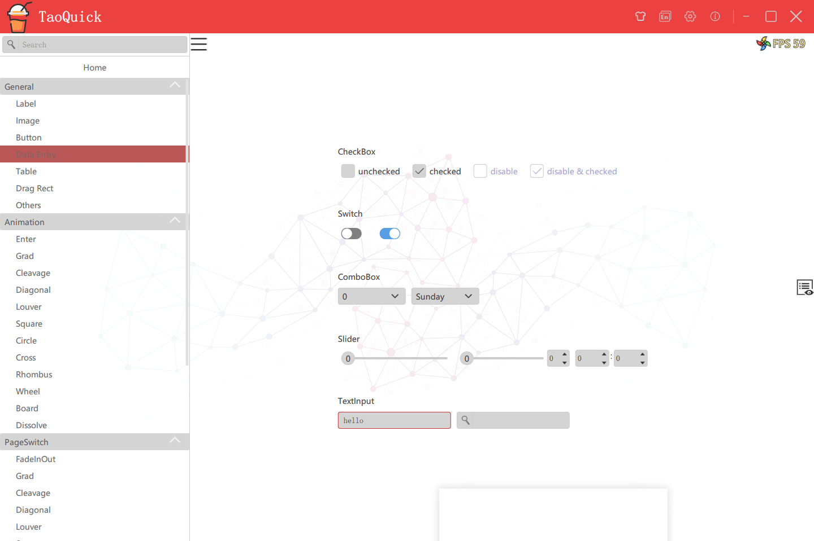
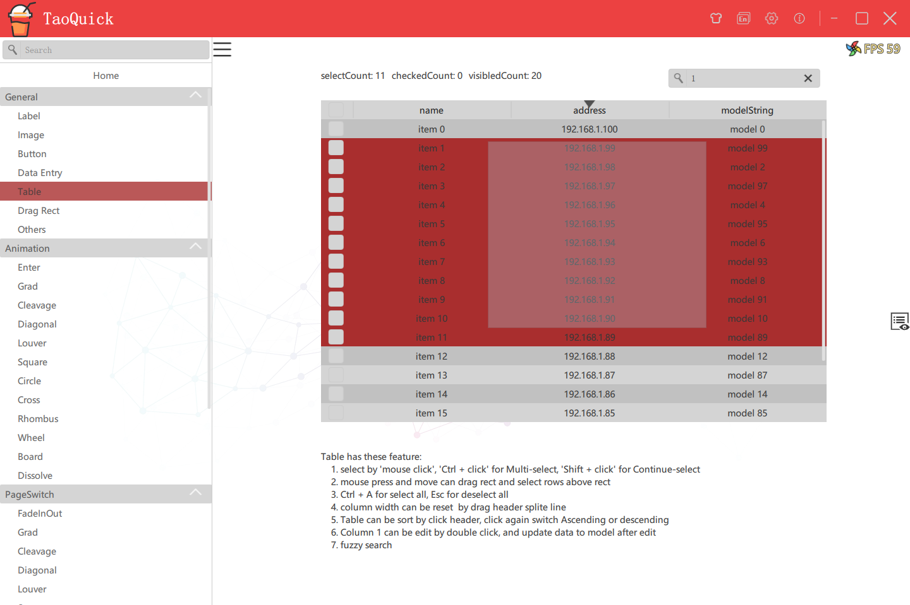
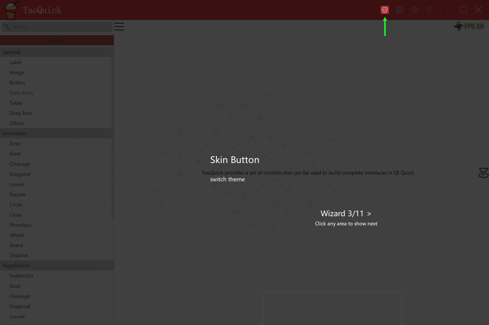

[简体中文](README-zh.md)

-------------------------------------------------------------

# Contents
- [Contents](#contents)
- [TaoQuick](#taoquick)
- [Badge preview](#badge-preview)
  - [Project](#project)
  - [Build](#build)
  - [Release](#release)
  - [Repository status](#repository-status)
  - [Issue](#issue)
  - [Other status](#other-status)
- [Some Demo Preview](#some-demo-preview)
  - [Main Page](#main-page)
  - [Change Skin](#change-skin)
  - [Multi-Language](#multi-language)
  - [Some Button Controls](#some-button-controls)
  - [Data entry Controls](#data-entry-controls)
  - [Table Controls](#table-controls)
  - [Rect Drag Controls](#rect-drag-controls)
  - [Wizard](#wizard)
  - [ShaderToy-Snail](#shadertoy-snail)
  - [ShaderToy-SuperMario](#shadertoy-supermario)
- [Environment](#environment)
- [Project Struct](#project-struct)
- [TaoQuick Core Library](#taoquick-core-library)
- [Use TaoQuick](#use-taoquick)
  - [qmake](#qmake)
  - [cmake](#cmake)
- [Sponsorship](#sponsorship)
  
# TaoQuick

This is a QtQuick/Qml Component library, integrated some commonly used QtQuick components, and 

make the appropriate function expansion to  facilitate development of Qml applications.

# Badge preview

## Project

|[Best Practices plan][CII-link]|[License][license-link]|
|:--:|:--:|
|![CII-badge]|![license-badge]|

[license-link]: https://github.com/jaredtao/TaoQuick/blob/master/LICENSE "LICENSE"
[license-badge]: https://img.shields.io/badge/license-MIT-blue.svg "MIT"
[CII-badge]: https://bestpractices.coreinfrastructure.org/projects/3060/badge
[CII-link]: https://bestpractices.coreinfrastructure.org/projects/3060

## Build

|platform|arch|Qt version|status|
|--|--|--|--|
|Windows|x86|5.9.9|![windows-qt5_9_9-win32_msvc2015-badge]|
|Windows|x64|5.9.9|![windows-qt5_9_9-win64_msvc2017-badge]|
|Windows|x86|5.12.10|![windows-qt5_12_10-win32_msvc2017-badge]|
|Windows|x64|5.12.10|![windows-qt5_12_10-win64_msvc2017-badge]|
|Windows|x86|5.15.2|![windows-qt5_15_2-win32_msvc2019-badge]|
|Windows|x64|5.15.2|![windows-qt5_15_2-win64_msvc2019-badge]|
|ubuntu18_04|x64|5.9.9|![ubuntu18_04-qt5_9_9-badge]|
|ubuntu18_04|x64|5.12.10|![ubuntu18_04-qt5_12_10-badge]|
|ubuntu18_04|x64|5.15.2|![ubuntu18_04-qt5_15_2-badge]|
|ubuntu20_04|x64|5.9.9|![ubuntu20_04-qt5_9_9-badge]|
|ubuntu20_04|x64|5.12.10|![ubuntu20_04-qt5_12_10-badge]|
|ubuntu20_04|x64|5.15.2|![ubuntu20_04-qt5_15_2-badge]|
|macos10_15|x64|5.9.9|![macos10_15-qt5_9_9-badge]|
|macos10_15|x64|5.12.10|![macos10_15-qt5_12_10-badge]|
|macos10_15|x64|5.15.2|![macos10_15-qt5_15_2-badge]|
|macos11_0|x64|5.9.9|![macos11_0-qt5_9_9-badge]|
|macos11_0|x64|5.12.10|![macos11_0-qt5_12_10-badge]|
|macos11_0|x64|5.15.2|![macos11_0-qt5_15_2-badge]|
|ios-macos10_15|x64|5.12.10|![ios-macos10_15-qt5_12_10-badge]|
|ios-macos10_15|x64|5.15.2|![ios-macos10_15-qt5_15_2-badge]|
|ios-macos11_0|x64|5.12.10|![ios-macos11_0-qt5_12_10-badge]|
|ios-macos11_0|x64|5.15.2|![ios-macos11_0-qt5_15_2-badge]|
|android-x86|x86|5.12.10|![android-x86-qt5_12_10-badge]|
|android-armv7|armv7|5.12.10|![android-armv7-qt5_12_10-badge]|
|android-arm64_v8a|arm64_v8a|5.12.10|![android-arm64_v8a-qt5_12_10-badge]|
|android|android|5.15.2|![android-qt5_15_2-badge]|

[windows-qt5_9_9-win32_msvc2015-badge]: https://github.com/JaredTao/TaoQuick/workflows/windows-qt5_9_9-win32_msvc2015/badge.svg  "windows-qt5_9_9-win32_msvc2015"

[windows-qt5_9_9-win64_msvc2017-badge]: https://github.com/JaredTao/TaoQuick/workflows/windows-qt5_9_9-win64_msvc2017/badge.svg  "windows-qt5_9_9-win64_msvc2017"

[windows-qt5_12_10-win32_msvc2017-badge]: https://github.com/JaredTao/TaoQuick/workflows/windows-qt5_12_10-win32_msvc2017/badge.svg  "windows-qt5_12_10-win32_msvc2017"

[windows-qt5_12_10-win64_msvc2017-badge]: https://github.com/JaredTao/TaoQuick/workflows/windows-qt5_12_10-win64_msvc2017/badge.svg  "windows-qt5_12_10-win64_msvc2017"

[windows-qt5_15_2-win32_msvc2019-badge]: https://github.com/JaredTao/TaoQuick/workflows/windows-qt5_15_2-win32_msvc2019/badge.svg  "windows-qt5_15_2-win32_msvc2019"

[windows-qt5_15_2-win64_msvc2019-badge]: https://github.com/JaredTao/TaoQuick/workflows/windows-qt5_15_2-win64_msvc2019/badge.svg  "windows-qt5_15_2-win64_msvc2019"

[ubuntu18_04-qt5_9_9-badge]: https://github.com/JaredTao/TaoQuick/workflows/ubuntu18_04-qt5_9_9/badge.svg  "ubuntu18_04-qt5_9_9"

[ubuntu18_04-qt5_12_10-badge]: https://github.com/JaredTao/TaoQuick/workflows/ubuntu18_04-qt5_12_10/badge.svg  "ubuntu18_04-qt5_12_10"

[ubuntu18_04-qt5_15_2-badge]: https://github.com/JaredTao/TaoQuick/workflows/ubuntu18_04-qt5_15_2/badge.svg  "ubuntu18_04-qt5_15_2"

[ubuntu20_04-qt5_9_9-badge]: https://github.com/JaredTao/TaoQuick/workflows/ubuntu20_04-qt5_9_9/badge.svg  "ubuntu20_04-qt5_9_9"

[ubuntu20_04-qt5_12_10-badge]: https://github.com/JaredTao/TaoQuick/workflows/ubuntu20_04-qt5_12_10/badge.svg  "ubuntu20_04-qt5_12_10"

[ubuntu20_04-qt5_15_2-badge]: https://github.com/JaredTao/TaoQuick/workflows/ubuntu20_04-qt5_15_2/badge.svg  "ubuntu20_04-qt5_15_2"

[macos10_15-qt5_9_9-badge]: https://github.com/JaredTao/TaoQuick/workflows/macos10_15-qt5_9_9/badge.svg  "macos10_15-qt5_9_9"

[macos10_15-qt5_12_10-badge]: https://github.com/JaredTao/TaoQuick/workflows/macos10_15-qt5_12_10/badge.svg  "macos10_15-qt5_12_10"

[macos10_15-qt5_15_2-badge]: https://github.com/JaredTao/TaoQuick/workflows/macos10_15-qt5_15_2/badge.svg  "macos10_15-qt5_15_2"

[macos11_0-qt5_9_9-badge]: https://github.com/JaredTao/TaoQuick/workflows/macos11_0-qt5_9_9/badge.svg  "macos11_0-qt5_9_9"

[macos11_0-qt5_12_10-badge]: https://github.com/JaredTao/TaoQuick/workflows/macos11_0-qt5_12_10/badge.svg  "macos11_0-qt5_12_10"

[macos11_0-qt5_15_2-badge]: https://github.com/JaredTao/TaoQuick/workflows/macos11_0-qt5_15_2/badge.svg  "macos11_0-qt5_15_2"

[ios-macos10_15-qt5_12_10-badge]: https://github.com/JaredTao/TaoQuick/workflows/ios-macos10_15-qt5_12_10/badge.svg  "ios-macos10_15-qt5_12_10"

[ios-macos10_15-qt5_15_2-badge]: https://github.com/JaredTao/TaoQuick/workflows/ios-macos10_15-qt5_15_2/badge.svg  "ios-macos10_15-qt5_15_2"

[ios-macos11_0-qt5_12_10-badge]: https://github.com/JaredTao/TaoQuick/workflows/ios-macos11_0-qt5_12_10/badge.svg  "ios-macos11_0-qt5_12_10"

[ios-macos11_0-qt5_15_2-badge]: https://github.com/JaredTao/TaoQuick/workflows/ios-macos11_0-qt5_15_2/badge.svg  "ios-macos11_0-qt5_15_2"

[android-x86-qt5_12_10-badge]: https://github.com/JaredTao/TaoQuick/workflows/android-x86-qt5_12_10/badge.svg  "android-x86-qt5_12_10"

[android-armv7-qt5_12_10-badge]: https://github.com/JaredTao/TaoQuick/workflows/android-armv7-qt5_12_10/badge.svg  "android-armv7-qt5_12_10"

[android-arm64_v8a-qt5_12_10-badge]: https://github.com/JaredTao/TaoQuick/workflows/android-arm64_v8a-qt5_12_10/badge.svg  "android-arm64_v8a-qt5_12_10"

[android-qt5_15_2-badge]: https://github.com/JaredTao/TaoQuick/workflows/android-qt5_15_2/badge.svg  "android-qt5_15_2"

## Release

|[Released][release-link]|[Download][download-link]|Download count|
|:--:|:--:|:--:|
|![release-badge] |![download-badge]|![download-latest]|

[release-link]: https://github.com/jaredtao/TaoQuick/releases "Release status"
[release-badge]: https://img.shields.io/github/release/jaredtao/TaoQuick.svg?style=flat-square "Release status"
[download-link]: https://github.com/jaredtao/TaoQuick/releases/latest "Download status"
[download-badge]: https://img.shields.io/github/downloads/jaredtao/TaoQuick/total.svg "Download status"
[download-latest]: https://img.shields.io/github/downloads/jaredtao/TaoQuick/latest/total.svg "latest status"

## Repository status

|Tag|Languages|Top Language|code size|repo size|
|:--: |:--: |:--:|:--:|:--:|
|![tag-latest]|![languanges]|![taolanguage]|![code-size]|![repo-size]|

[languanges]: https://img.shields.io/github/languages/count/jaredtao/taoquick.svg "language count"
[taolanguage]: https://img.shields.io/github/languages/top/jaredtao/taoquick.svg "top language"
[code-size]: https://img.shields.io/github/languages/code-size/jaredtao/taoquick.svg "code size"
[repo-size]: https://img.shields.io/github/repo-size/jaredtao/taoquick.svg "repo-size"
[tag-latest]: https://img.shields.io/github/tag/jaredtao/taoquick.svg

## Issue
|[Issues][issues-link]|pull request|
|:--:|:--:|
|![issuse-badge]|![pull-request]|

[issues-link]: https://github.com/jaredtao/TaoQuick/issues 
[issuse-badge]: https://img.shields.io/github/issues/jaredtao/taoquick.svg?style=popout 
[issue-closed]: https://img.shields.io/github/issues-closed/jaredtao/taoquick.svg
[pull-request]: https://img.shields.io/github/issues-pr/jaredtao/taoquick.svg
[pull-closed]: https://img.shields.io/github/issues-pr-closed/jaredtao/taoquick.svg

## Other status

|commit freq|last commit|date|forks|stars|
|:--:|:--:|:--:|:--:|:--:|
|![commit-active]|![commit-latest]|![release-date]|![forks-badge]|![stars-badge]|

[forks-badge]: https://img.shields.io/github/forks/jaredtao/taoquick.svg "forks"
[stars-badge]: https://img.shields.io/github/stars/jaredtao/taoquick.svg "stars"
[commit-active]: https://img.shields.io/github/commit-activity/w/jaredtao/taoquick.svg
[commit-latest]: https://img.shields.io/github/last-commit/jaredtao/taoquick.svg
[release-date]: https://img.shields.io/github/release-date/jaredtao/taoquick.svg


# Some Demo Preview

## Main Page



## Change Skin



## Multi-Language


## Some Button Controls



## Data entry Controls



## Table Controls



## Rect Drag Controls


## Wizard




## ShaderToy-Snail


## ShaderToy-SuperMario


# Environment

* Qt 5.9.0 or later

* compatibility Qt5.15

# Project Struct

Project Struct as flow:


echo content as table：

|Content|Reference|Remark|
|----|----|----|
|src|TaoQuick Core Library|some qml code, picture and scripts for support designer, not has c++ code|
|exampes|some demo|show how to use TaoQuick Core Library|
|3rdparty|thrid party library||
|mkspecs|qmake extern||
|.github|github-actions|CI CD|

# TaoQuick Core Library

Core Library source code path:

src/TaoQuick/imports/TaoQuick/Qml

Content:


To avoid confusion with Qt default components, TaoQuick components names all begin with Cus (The abbreviation of Custom)

CusConfig is global configuration, mainly contain font、 theme and so on, all components are displayed in this configuration

Other Contents reference to above table：

|Content|Reference|Remark|
|----|----|----|
|Basic|Basic Controls| such as Text, ToolTip, It is used to unify the basic components in the whole project and facilitate the global replacement when the project becomes huge|
|CusBackground|A simple background box|it is usually placed at the beginning of the program to absorb mouse focus from the white space|
|CusButton|button|Some commonly used buttons have been encapsulated, and various effects can be customized again|
|CusCheckBox|CheckBox||
|CusComboBox|ComboBox||
|CusImage|Basic Image||
|CusInput|Input||
|CusLabel|Label||
|CusListView|List|Simaple custom scrollbars|
|CusPopup|Popup||
|CusScroll|ScrollBar||
|CusSlider|Slider||
|CusSpinBox|SpinBox||
|CusTable|Table|It needs to be used with specific C++ model to support the selection, check, draw rect selection, anti-selection, continuous selection and all selection|
|Effect|Effect|Animation、PageSwitch and ShaderToy|
|Misc|Others||

# Use TaoQuick 

## qmake 

You just need import '.pri' file to project and add import Path to QmlEngine, TaoQuick will be use as local file or qrc resource.

Compared with 'Qml module' and 'Qml C++ plugin', this usage has the following advantages:

* After importing '.pri', no additional compile, generation of dll or plugin are required

* No additional copy resources are required to deployment the program

* After importing '.pri', Qt Creater can support TaoQuick Qml code highlighting and double-clicking the Follow symbol

* After import the module 'import TaoQuick 1.0' in Qml, you can use the TaoQuick component in The Designer mode of Qt Creater by dragging or visual property editor.(principle: Generate metainfo required by Designer via some script) 


detail use step：

1. copy src/TaoQuick to your project, in any location

2. Import 'pri' files in the corresponding TaoQuick folder in your project 'pro' file

for eaxmple: 

```qmake
include(TaoQuick/TaoQuick.pri)
```

or

```qmake
include(src/TaoQuick/imports/imports.pri)
```

TaoQuick.pri will define two MACRO: TaoQuickImportPath and TaoQuickImagePath.

Debug mode will use TaoQuick as local file, and release mode for qrc resource.


3. add import path in cpp

  Before load source qml, TaoQuick need add import path to QmlEngine and set imagePath to context.

  if use QQuickView, TaoQuick can be use as flow:
   
```C++
    view.engine()->addImportPath(TaoQuickImportPath);
    view.rootContext()->setContextProperty("taoQuickImagePath", TaoQuickImagePath);
```

   if use QmlEngine, TaoQuick can be use as flow:

```C++
    engine.addImportPath(TaoQuickImportPath);
    engine.rootContext()->setContextProperty("taoQuickImagePath", TaoQuickImagePath);
```

***
## cmake

TaoQuick start support cmake after version 0.5.0 , it's same as qmake.

detail use step：

1. copy src/TaoQuick to your project, in any location

2. copy cmake/taoQuick.cmake to your project, in any location

and make sure the first line of taoQuick.cmake location to correct TaoQuick path

3. add cmake extern path in your CMakeLists.txt

add extern path:

```cmake
  SET(CMAKE_MODULE_PATH ${CMAKE_CURRENT_SOURCE_DIR}/cmake)
```
then load taoQuick by 'include'

```cmake
include(taoQuick)
```
taoQuick.cmake will define two MACRO: TaoQuickImportPath and TaoQuickImagePath.

Debug mode will use TaoQuick as local file, and release mode for qrc resource.

Release mode taoQuick.cmake also define a MACRO TaoQuickRes, that location to qrc file.

your project should add TaoQuickRes to executable, like this:

```cmake
if (CMAKE_BUILD_TYPE MATCHES "Release")
    add_executable(MyApp ${someSource} ${TaoQuickRes})
else()
    add_executable(MyApp ${someSource})
endif()
```
4. add import path in cpp

  Before load source qml, TaoQuick need add import path to QmlEngine and set imagePath to context.

  if use QQuickView, TaoQuick can be use as flow:
   
```C++
    view.engine()->addImportPath(TaoQuickImportPath);
    view.rootContext()->setContextProperty("taoQuickImagePath", TaoQuickImagePath);
```

   if use QmlEngine, TaoQuick can be use as flow:

```C++
    engine.addImportPath(TaoQuickImportPath);
    engine.rootContext()->setContextProperty("taoQuickImagePath", TaoQuickImagePath);
```

# Sponsorship

If you feel the share content is good, treat the author a drink.


it's WeChat Pay and Alipay
