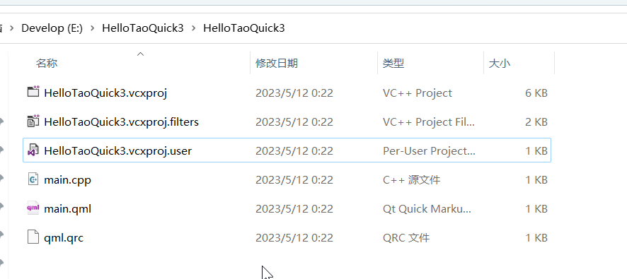
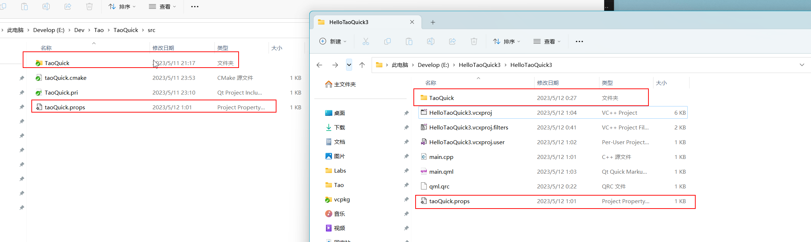
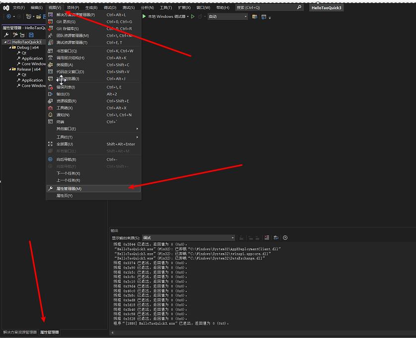
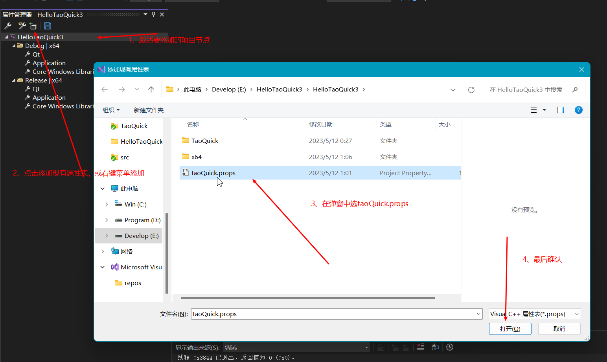
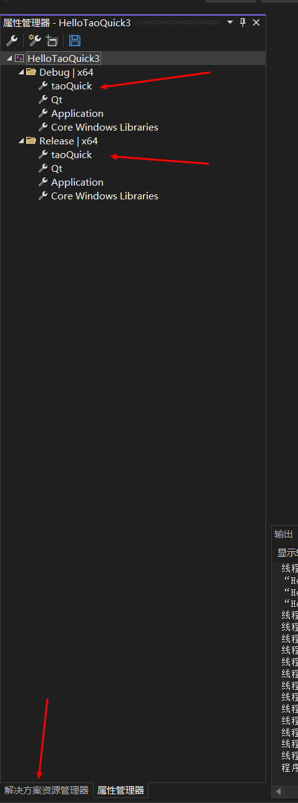

# 入门指南

- [入门指南](#入门指南)
- [1、qmake 使用TaoQuick示例](#1qmake-使用taoquick示例)
  - [1.1 创建Qml工程](#11-创建qml工程)
  - [1.2 拷贝TaoQuick核心库](#12-拷贝taoquick核心库)
  - [1.3 导入核心库](#13-导入核心库)
  - [1.4 增加导入路径](#14-增加导入路径)
    - [1.4.1 两种不同Qml工程的说明](#141-两种不同qml工程的说明)
    - [1.4.2 设置路径](#142-设置路径)
  - [1.5 Qml中使用TaoQuick组件](#15-qml中使用taoquick组件)
    - [1.5.1 import TaoQuick](#151-import-taoquick)
    - [1.5.2 使用蓝色按钮组件](#152-使用蓝色按钮组件)
  - [1.6. 运行效果](#16-运行效果)
- [2. qmake用法说明](#2-qmake用法说明)
- [3.cmake 使用TaoQuick示例](#3cmake-使用taoquick示例)
  - [3.1 创建工程](#31-创建工程)
  - [3.2 拷贝TaoQuick核心库](#32-拷贝taoquick核心库)
  - [3.3 导入核心库](#33-导入核心库)
  - [3.4 增加导入路径](#34-增加导入路径)
    - [3.4.1 两种不同Qml工程的说明](#341-两种不同qml工程的说明)
    - [3.4.2 设置路径](#342-设置路径)
  - [3.5 使用TaoQuick组件](#35-使用taoquick组件)
    - [3.5.1 import TaoQuick](#351-import-taoquick)
    - [3.5.2 使用蓝色按钮组件](#352-使用蓝色按钮组件)
  - [3.6 运行效果](#36-运行效果)
- [4. Visual Studio 解决方案使用TaoQuick](#4-visual-studio-解决方案使用taoquick)
  - [4.1 创建工程](#41-创建工程)
  - [4.2 拷贝TaoQuick核心库](#42-拷贝taoquick核心库)
  - [4.3 导入核心库](#43-导入核心库)
    - [4.3.1 vs 切换到项目的 "属性管理器"页签](#431-vs-切换到项目的-属性管理器页签)
    - [4.3.2 导入"taoQuick.props"](#432-导入taoquickprops)
  - [4.4 增加导入路径](#44-增加导入路径)
    - [4.4.1 两种不同Qml工程的说明](#441-两种不同qml工程的说明)
    - [4.4.2 设置路径](#442-设置路径)
  - [4.5 使用TaoQuick组件](#45-使用taoquick组件)
    - [4.5.1 import TaoQuick](#451-import-taoquick)
    - [4.5.2 使用蓝色按钮组件](#452-使用蓝色按钮组件)
  - [4.6 运行效果](#46-运行效果)

# 1、qmake 使用TaoQuick示例

## 1.1 创建Qml工程
   
   
使用QtCreator创建一个简易的Qml工程，或者使用已有的工程。

这里示例创建一个HelloTaoQuick1 工程，内容如下：


pro文件包含基本的Qml工程配置

```pro
TEMPLATE = app

QT += gui quick qml quickcontrols2

SOURCES += main.cpp

RESOURCES += Res.qrc
```

qrc资源文件中, 仅添加main.qml

```xml
<RCC>
    <qresource prefix="/">    
        <file>main.qml</file>
    </qresource>
</RCC>
```

## 1.2 拷贝TaoQuick核心库

将TaoQuick/src文件夹下的"TaoQuick子文件夹"及"TaoQuick.pri"文件拷贝过来，放在HelloTaoQuick1 工程目录下


如图所示，HelloTaoQuick1 项目文件夹下，多了一个TaoQuick文件夹，内含 TaoQuick.pri文件和imports文件夹。

## 1.3 导入核心库

在项目的HelloTaoQuick1.pro文件中，增加一行`include(TaoQuick.pri)`，包含相对工程路径下的TaoQuick.pri文件

```pro
TEMPLATE = app

QT += gui quick qml quickcontrols2

SOURCES += main.cpp

RESOURCES += Res.qrc

include(TaoQuick.pri)
```

TaoQuick.pri文件提供了一个宏定义: TaoQuickImportPath 。

这个宏指向了TaoQuick核心库的导入路径，

需要将此路径添加到QmlEngine中，Qml才能识别TaoQuick库。

(2023/5/11更新到1.2版本：1.2版本之前是两个宏，1.2版本开始只需要一个宏即可)

## 1.4 增加导入路径

### 1.4.1 两种不同Qml工程的说明
对于一般的Qml工程，最简单的main.cpp内容，可以有两种使用方式，

使用QQuickView：

```C++
#include <QQuickView>
#include <QGuiApplication>
int main(int argc, char **argv)
{
    QCoreApplication::setAttribute(Qt::AA_EnableHighDpiScaling);

    QGuiApplication app(argc, argv);
    QQuickView view;
    view.setSource(QUrl("qrc:/main.qml"));
    view.show();
    
    return app.exec();
}
```

或者使用QQmlApplicationEngine:

```C++
#include <QGuiApplication>
#include <QQmlApplicationEngine>

int main(int argc, char *argv[])
{
    QCoreApplication::setAttribute(Qt::AA_EnableHighDpiScaling);

    QGuiApplication app(argc, argv);

    QQmlApplicationEngine engine;
    const QUrl url(QStringLiteral("qrc:/main.qml"));
    QObject::connect(&engine, &QQmlApplicationEngine::objectCreated,
        &app, [url](QObject *obj, const QUrl &objUrl) {
            if (!obj && url == objUrl)
                QCoreApplication::exit(-1);
        }, Qt::QueuedConnection);
    engine.load(url);

    return app.exec();
}

```
两种用法本质是一样的，细微区别是：

QQuickView本身就是一个主窗口，main.qml顶层元素不能是Window或者Window的子类；

QQmlEngine本身不包含主窗口，main.qml顶层元素必须是Window或者Window的子类。

### 1.4.2 设置路径

我们需要在QmlEngine加载source之前，增加importPath，并把importPath设置为上下文属性。

如果主窗口是由QQuickView加载的，则：
   
```C++
    view.engine()->addImportPath(TaoQuickImportPath);
    view.rootContext()->setContextProperty("taoQuickImportPath", TaoQuickImportPath);
```

如果主窗口是由QQmlEngine加载的，则:

```C++
    engine.addImportPath(TaoQuickImportPath);
    engine.rootContext()->setContextProperty("taoQuickImportPath", TaoQuickImportPath);
```

注意：上下文属性的首字母要小写。

完整的代码如下:

QQuickView版本
```C++
#include <QQuickView>
#include <QQmlEngine>
#include <QQmlContext>
#include <QGuiApplication>
int main(int argc, char **argv)
{
    QCoreApplication::setAttribute(Qt::AA_EnableHighDpiScaling);

    QGuiApplication app(argc, argv);
    QQuickView view;
    
    view.engine()->addImportPath(TaoQuickImportPath);
    view.rootContext()->setContextProperty("taoQuickImportPath", TaoQuickImportPath);
    //setSource 之前，要设置好路径
    view.setSource(QUrl("qrc:/main.qml"));
    view.show();
    
    return app.exec();
}
```
QQmlApplicationEngine版本:

```C++
#include <QGuiApplication>
#include <QQmlApplicationEngine>
#include <QQmlContext>
int main(int argc, char *argv[])
{
    QCoreApplication::setAttribute(Qt::AA_EnableHighDpiScaling);

    QGuiApplication app(argc, argv);

    QQmlApplicationEngine engine;
    engine.addImportPath(TaoQuickImportPath);
    engine.rootContext()->setContextProperty("taoQuickImportPath", TaoQuickImportPath);

    const QUrl url(QStringLiteral("qrc:/main.qml"));
    QObject::connect(&engine, &QQmlApplicationEngine::objectCreated,
        &app, [url](QObject *obj, const QUrl &objUrl) {
            if (!obj && url == objUrl)
                QCoreApplication::exit(-1);
        }, Qt::QueuedConnection);

    //load 之前，设置好路径
    engine.load(url);

    return app.exec();
}
```
## 1.5 Qml中使用TaoQuick组件

用一个简单的main.qml来举例,内容如下：

QQuickView版本
```qml
import QtQml 2.0
import QtQuick 2.9


Rectangle {
    color: "lightblue"
    width: 640
    height: 480
}

```
QQmlEngine版本
```qml
import QtQuick 2.9
import QtQuick.Window 2.9

Window {
    width: 640
    height: 480
    visible: true
    title: qsTr("Hello World")
}

```
### 1.5.1 import TaoQuick

接下来增加一行import,导入TaoQuick

```qml
import TaoQuick 1.0
import QtQml 2.0
import QtQuick 2.9

Rectangle {
    color: "lightblue"
    width: 640
    height: 480
}

```
导入过后，按一下Ctrl + S，保存一下。

只要路径正确，QtCreator就可以识别到TaoQuick库，可以直接使用TaoQuick库中的组件。

### 1.5.2 使用蓝色按钮组件

这里示例，使用蓝色按钮组件:
```qml
...
    CusButton_Blue {
        width: 120
        height: 36
        anchors.centerIn: parent
        text: "Hello"
        onClicked: {
            console.log("hello TaoQuick")
        }
    }
...
```
TaoQuick库已经做好了QtCreator的语法高亮和Qml代码跳转


当然也可以切换到Design模式，以拖拽、属性编辑的方式，创建、编辑组件


## 1.6. 运行效果
 
 最后，运行起来看看效果吧


# 2. qmake用法说明

使用核心库，只需要在项目中导入'TaoQuick.pri'文件，并将qml路径加入到QmlEngine即可。

TaoQuick组件将以本地文件或qrc资源的方式被引用。

此种用法, 与Qml模块、Qml C++插件等方式相比，有以下优势:

* 导入pri后, 不需要额外编译、生成dll或插件

* 发布程序时不需要额外拷贝资源

* 导入pri后, Qt Creater即可支持TaoQuick的Qml代码高亮、双击跳转

* 导入pri后，在Qml中导入模块(import TaoQuick 1.0),即可在Qt Creater 的 designer模式中，通过拖拽使用TaoQuick组件、可视化开发UI 


TaoQuick.pri文件定义了一个宏：TaoQuickImportPath ，这个宏指向了TaoQuick的qml导入路径。

这个路径在debug模式指向了本地文件，这样方便快速调试，不用重启程序，编辑后重新加载页面即可生效。

release模型则指向了qrc资源文件，这样方便发布。

TaoQuick.pri提供了这几个变量，来支持QtCreator的语法高亮
```
QML_IMPORT_PATH	= $$PWD
QML2_IMPORT_PATH = $$PWD
QML_DESIGNER_IMPORT_PATH = $$PWD
```

(如果你的QtCreater没有语法高亮，可能是QtCreator早期版本Bug较多,可以尝试重启一下QtCreator，

或换个QtCreator版本。

如果程序能正常运行，只是语法高亮无效，你也可以先忽略语法高亮。毕竟QtCreator的bug不是一天两天了)


# 3.cmake 使用TaoQuick示例

## 3.1 创建工程

使用QtCreator创建一个简易的Qml工程，或者使用已有的工程。

这里示例创建一个HelloTaoQuick2 工程，内容如下：


其中工程文件，CMakeLists.txt内容如下：

```cmake
cmake_minimum_required(VERSION 3.14)

project(HelloTaoQuick2 LANGUAGES CXX)

set(CMAKE_INCLUDE_CURRENT_DIR ON)

set(CMAKE_AUTOUIC ON)
set(CMAKE_AUTOMOC ON)
set(CMAKE_AUTORCC ON)

set(CMAKE_CXX_STANDARD 11)
set(CMAKE_CXX_STANDARD_REQUIRED ON)

find_package(QT NAMES Qt6 Qt5 COMPONENTS Core Quick REQUIRED)
find_package(Qt${QT_VERSION_MAJOR} COMPONENTS Core Quick REQUIRED)

if(ANDROID)
    add_library(HelloTaoQuick2 SHARED
      main.cpp
      qml.qrc
    )
else()
    add_executable(HelloTaoQuick2
      main.cpp
      qml.qrc
    )
endif()

target_compile_definitions(HelloTaoQuick2
  PRIVATE $<$<OR:$<CONFIG:Debug>,$<CONFIG:RelWithDebInfo>>:QT_QML_DEBUG>)
target_link_libraries(HelloTaoQuick2
  PRIVATE Qt${QT_VERSION_MAJOR}::Core Qt${QT_VERSION_MAJOR}::Quick)

```

## 3.2 拷贝TaoQuick核心库

将TaoQuick/src文件夹下的"TaoQuick子文件夹"及"taoQuick.cmake"文件拷贝过来，放在HelloTaoQuick2 工程目录下


如图所示，HelloTaoQuick2 项目文件夹下，多了一个TaoQuick文件夹，及"taoQuick.cmake"文件。

## 3.3 导入核心库


在项目的CMakeLists.txt文件中，增加一句`include(taoQuick.camke)`,导入taoQuick.cmake文件


在项目的add_executable指令中，增加一项TaoQuickRes


taoQuick.cmake文件提供了一个宏定义: TaoQuickImportPath 。

这个宏指向了TaoQuick核心库的导入路径，

需要将此路径添加到QmlEngine中，Qml才能识别TaoQuick库。(见下一节)

(2023/5/11更新到1.2版本：1.2版本之前是两个宏，1.2版本开始只需要一个宏即可)

Debug模式TaoQuick使用本地文件，方便快速调试。

Release模式则使用qrc资源，方便发布。

因此taoQuick.cmake还提供了一个宏：TaoQuickRes，需要将其加入到cmake的依赖项中，例如：

```cmake
if (CMAKE_BUILD_TYPE MATCHES "Release")
    add_executable(MyApp ${someSource} ${TaoQuickRes})
else()
    add_executable(MyApp ${someSource})
endif()
```

## 3.4 增加导入路径

### 3.4.1 两种不同Qml工程的说明
对于一般的Qml工程，最简单的main.cpp内容，可以有两种使用方式，

使用QQuickView：

```C++
#include <QQuickView>
#include <QGuiApplication>
int main(int argc, char **argv)
{
    QCoreApplication::setAttribute(Qt::AA_EnableHighDpiScaling);

    QGuiApplication app(argc, argv);
    QQuickView view;
    view.setSource(QUrl("qrc:/main.qml"));
    view.show();
    
    return app.exec();
}
```

或者使用QQmlApplicationEngine:

```C++
#include <QGuiApplication>
#include <QQmlApplicationEngine>

int main(int argc, char *argv[])
{
    QCoreApplication::setAttribute(Qt::AA_EnableHighDpiScaling);

    QGuiApplication app(argc, argv);

    QQmlApplicationEngine engine;
    const QUrl url(QStringLiteral("qrc:/main.qml"));
    QObject::connect(&engine, &QQmlApplicationEngine::objectCreated,
        &app, [url](QObject *obj, const QUrl &objUrl) {
            if (!obj && url == objUrl)
                QCoreApplication::exit(-1);
        }, Qt::QueuedConnection);
    engine.load(url);

    return app.exec();
}

```
两种用法本质是一样的，细微区别是：

QQuickView本身就是一个主窗口，main.qml顶层元素不能是Window或者Window的子类；

QQmlEngine本身不包含主窗口，main.qml顶层元素必须是Window或者Window的子类。

### 3.4.2 设置路径

我们需要在QmlEngine加载source之前，增加importPath，并把imagePath设置为上下文。

如果主窗口是由QQuickView加载的，则：
   
```C++
    view.engine()->addImportPath(TaoQuickImportPath);
    view.rootContext()->setContextProperty("taoQuickImportPath", TaoQuickImportPath);
```

如果主窗口是由QQmlEngine加载的，则:

```C++
    engine.addImportPath(TaoQuickImportPath);
    engine.rootContext()->setContextProperty("taoQuickImportPath", TaoQuickImportPath);
```

注意：上下文属性的首字母要小写。

完整的代码如下:

QQuickView版本
```C++
#include <QQuickView>
#include <QQmlEngine>
#include <QQmlContext>
#include <QGuiApplication>
int main(int argc, char **argv)
{
    QCoreApplication::setAttribute(Qt::AA_EnableHighDpiScaling);

    QGuiApplication app(argc, argv);
    QQuickView view;
    
    view.engine()->addImportPath(TaoQuickImportPath);
    view.rootContext()->setContextProperty("taoQuickImportPath", TaoQuickImportPath);
    //setSource 之前，要设置好路径
    view.setSource(QUrl("qrc:/main.qml"));
    view.show();
    
    return app.exec();
}
```
QQmlApplicationEngine版本:

```C++
#include <QGuiApplication>
#include <QQmlApplicationEngine>
#include <QQmlContext>
int main(int argc, char *argv[])
{
    QCoreApplication::setAttribute(Qt::AA_EnableHighDpiScaling);

    QGuiApplication app(argc, argv);

    QQmlApplicationEngine engine;
    engine.addImportPath(TaoQuickImportPath);
    engine.rootContext()->setContextProperty("taoQuickImportPath", TaoQuickImportPath);

    const QUrl url(QStringLiteral("qrc:/main.qml"));
    QObject::connect(&engine, &QQmlApplicationEngine::objectCreated,
        &app, [url](QObject *obj, const QUrl &objUrl) {
            if (!obj && url == objUrl)
                QCoreApplication::exit(-1);
        }, Qt::QueuedConnection);

    //load 之前，设置好路径
    engine.load(url);

    return app.exec();
}
```
## 3.5 使用TaoQuick组件

一个简单的main.qml,内容如下：

QQuickView版本
```qml
import QtQml 2.0
import QtQuick 2.9


Rectangle {
    color: "lightblue"
    width: 640
    height: 480
}

```
Engine版本
```qml
import QtQuick 2.9
import QtQuick.Window 2.9

Window {
    width: 640
    height: 480
    visible: true
    title: qsTr("Hello World")
}

```

### 3.5.1 import TaoQuick

接下来增加一行import,导入TaoQuick

```qml
import TaoQuick 1.0
import QtQml 2.0
import QtQuick 2.9

Rectangle {
    color: "lightblue"
    width: 640
    height: 480
}

```
导入过后，按一下Ctrl + S，保存一下。

只要路径正确，QtCreator就可以识别到TaoQuick库，可以直接使用TaoQuick库中的组件。

### 3.5.2 使用蓝色按钮组件


这里示例，使用蓝色按钮组件:
```qml
...
    CusButton_Blue {
        width: 120
        height: 36
        anchors.centerIn: parent
        text: "Hello"
        onClicked: {
            console.log("hello TaoQuick")
        }
    }
...
```

## 3.6 运行效果
 
 最后，运行起来看看效果吧


# 4. Visual Studio 解决方案使用TaoQuick

## 4.1 创建工程

使用VisualStudio 创建一个简易的Qml工程，或者使用已有的工程。

这里示例创建一个HelloTaoQuick3 工程，内容如下：



## 4.2 拷贝TaoQuick核心库

将TaoQuick/src文件夹下的"TaoQuick子文件夹"及"taoQuick.props"文件拷贝过来，放在HelloTaoQuick3 工程目录下



如图所示，HelloTaoQuick3项目文件夹下，多了一个TaoQuick文件夹，及"taoQuick.props"文件。

## 4.3 导入核心库

通过VS的属性管理器，将taoQuick.props文件导入到项目中即可。

### 4.3.1 vs 切换到项目的 "属性管理器"页签



可以直接点击底部的"属性管理器"页签，也可以通过菜单栏->视图->属性管理器切换

### 4.3.2 导入"taoQuick.props"

选中HelloTaoQuick3工程节点，然后点击 添加按钮，或者右键菜单添加



添加成功后，列表中出现taoQuick即可




## 4.4 增加导入路径

### 4.4.1 两种不同Qml工程的说明
对于一般的Qml工程，最简单的main.cpp内容，可以有两种使用方式，

使用QQuickView：

```C++
#include <QQuickView>
#include <QGuiApplication>
int main(int argc, char **argv)
{
    QCoreApplication::setAttribute(Qt::AA_EnableHighDpiScaling);

    QGuiApplication app(argc, argv);
    QQuickView view;
    view.setSource(QUrl("qrc:/main.qml"));
    view.show();
    
    return app.exec();
}
```

或者使用QQmlApplicationEngine:

```C++
#include <QGuiApplication>
#include <QQmlApplicationEngine>

int main(int argc, char *argv[])
{
    QCoreApplication::setAttribute(Qt::AA_EnableHighDpiScaling);

    QGuiApplication app(argc, argv);

    QQmlApplicationEngine engine;
    const QUrl url(QStringLiteral("qrc:/main.qml"));
    QObject::connect(&engine, &QQmlApplicationEngine::objectCreated,
        &app, [url](QObject *obj, const QUrl &objUrl) {
            if (!obj && url == objUrl)
                QCoreApplication::exit(-1);
        }, Qt::QueuedConnection);
    engine.load(url);

    return app.exec();
}

```
两种用法本质是一样的，细微区别是：

QQuickView本身就是一个主窗口，main.qml顶层元素不能是Window或者Window的子类；

QQmlEngine本身不包含主窗口，main.qml顶层元素必须是Window或者Window的子类。

### 4.4.2 设置路径

我们需要在QmlEngine加载source之前，增加importPath，并把imagePath设置为上下文。

如果主窗口是由QQuickView加载的，则：
   
```C++
    QString importPath = TaoQuickImportPath;
    importPath = importPath.replace("\\", "/");
    view.engine()->addImportPath(importPath);
    view.rootContext()->setContextProperty("taoQuickImportPath", importPath);
```

如果主窗口是由QQmlEngine加载的，则:

```C++
    QString importPath = TaoQuickImportPath;
    importPath = importPath.replace("\\", "/");
    engine.addImportPath(importPath);
    engine.rootContext()->setContextProperty("taoQuickImportPath", importPath);
```

注意：上下文属性的首字母要小写。

完整的代码如下:

QQuickView版本
```C++
#include <QQuickView>
#include <QQmlEngine>
#include <QQmlContext>
#include <QGuiApplication>
int main(int argc, char **argv)
{
    QCoreApplication::setAttribute(Qt::AA_EnableHighDpiScaling);

    QGuiApplication app(argc, argv);
    QQuickView view;
    
    QString importPath = TaoQuickImportPath;
    importPath = importPath.replace("\\", "/");
    view.engine()->addImportPath(importPath);
    view.rootContext()->setContextProperty("taoQuickImportPath", importPath);
    
    //setSource 之前，要设置好路径
    view.setSource(QUrl("qrc:/main.qml"));
    view.show();
    
    return app.exec();
}
```
QQmlApplicationEngine版本:

```C++
#include <QGuiApplication>
#include <QQmlApplicationEngine>
#include <QQmlContext>
int main(int argc, char *argv[])
{
    QCoreApplication::setAttribute(Qt::AA_EnableHighDpiScaling);

    QGuiApplication app(argc, argv);

    QQmlApplicationEngine engine;

    QString importPath = TaoQuickImportPath;
    importPath = importPath.replace("\\", "/");
    engine.addImportPath(importPath);
    engine.rootContext()->setContextProperty("taoQuickImportPath", importPath);

    const QUrl url(QStringLiteral("qrc:/main.qml"));
    QObject::connect(&engine, &QQmlApplicationEngine::objectCreated,
        &app, [url](QObject *obj, const QUrl &objUrl) {
            if (!obj && url == objUrl)
                QCoreApplication::exit(-1);
        }, Qt::QueuedConnection);

    //load 之前，设置好路径
    engine.load(url);

    return app.exec();
}
```
## 4.5 使用TaoQuick组件

一个简单的main.qml,内容如下：

QQuickView版本
```qml
import QtQml 2.0
import QtQuick 2.9


Rectangle {
    color: "lightblue"
    width: 640
    height: 480
}

```
Engine版本
```qml
import QtQuick 2.9
import QtQuick.Window 2.9

Window {
    width: 640
    height: 480
    visible: true
    title: qsTr("Hello World")
}

```

### 4.5.1 import TaoQuick

接下来增加一行import,导入TaoQuick

```qml
import TaoQuick 1.0
import QtQml 2.0
import QtQuick 2.9

Rectangle {
    color: "lightblue"
    width: 640
    height: 480
}

```
导入过后，按一下Ctrl + S，保存一下。

只要路径正确，QtCreator就可以识别到TaoQuick库，可以直接使用TaoQuick库中的组件。

### 4.5.2 使用蓝色按钮组件


这里示例，使用蓝色按钮组件:
```qml
...
    CusButton_Blue {
        width: 120
        height: 36
        anchors.centerIn: parent
        text: "Hello"
        onClicked: {
            console.log("hello TaoQuick")
        }
    }
...
```

## 4.6 运行效果
 
 最后，运行起来看看效果吧


