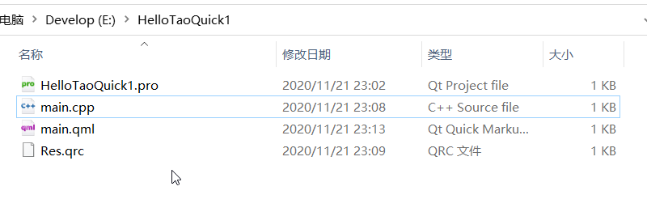
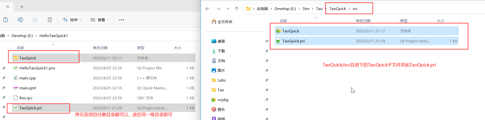
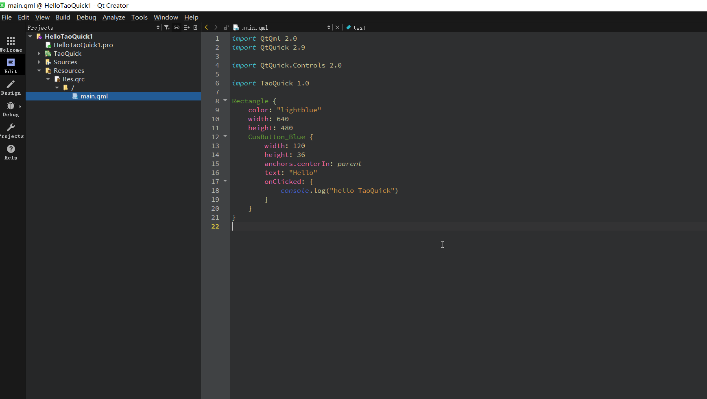
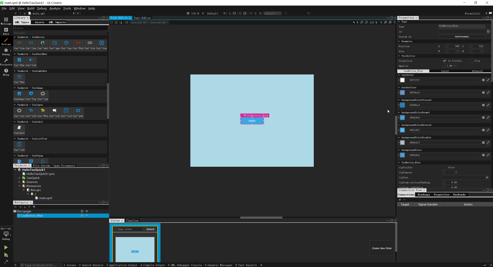
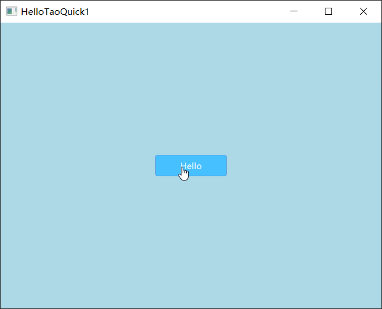
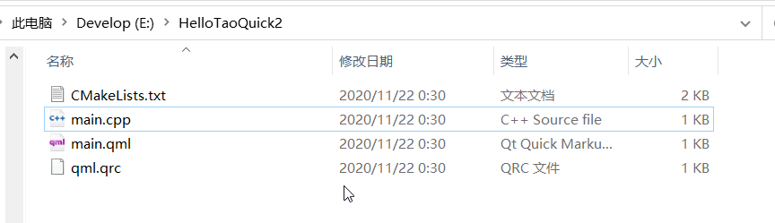
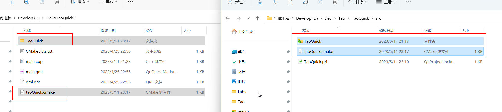
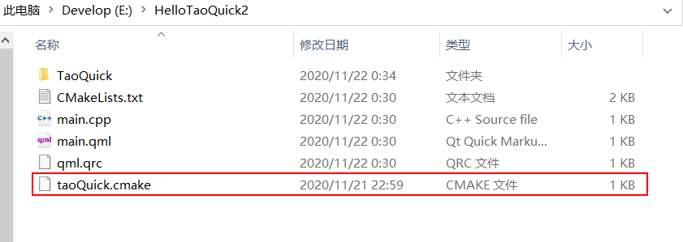
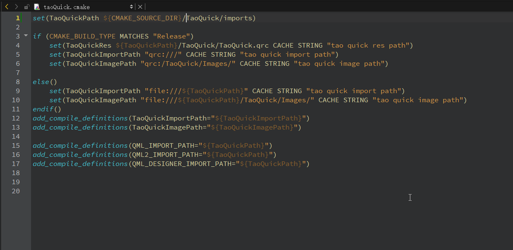
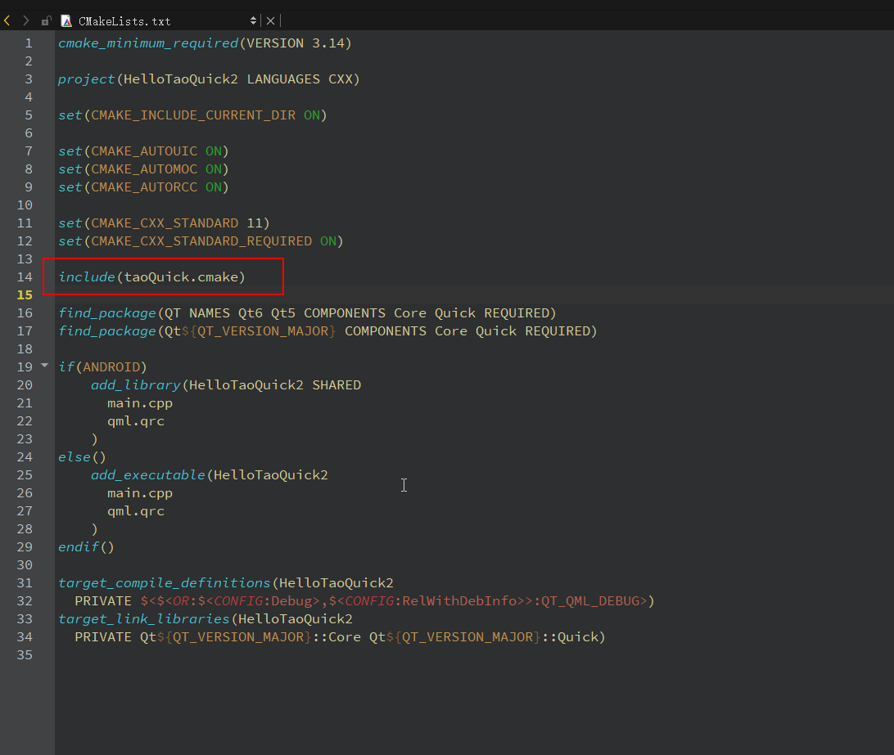

# 入门指南

- [入门指南](#入门指南)
- [qmake 使用TaoQuick](#qmake-使用taoquick)
  - [1. 创建Qml工程](#1-创建qml工程)
  - [2. 拷贝TaoQuick核心库](#2-拷贝taoquick核心库)
  - [3. 导入核心库](#3-导入核心库)
  - [4. 增加导入路径](#4-增加导入路径)
    - [4.1 两种不同Qml工程的说明](#41-两种不同qml工程的说明)
    - [4.2 设置路径](#42-设置路径)
  - [5. 使用TaoQuick组件](#5-使用taoquick组件)
  - [6. 运行效果](#6-运行效果)
- [cmake 使用TaoQuick](#cmake-使用taoquick)
  - [1.创建工程](#1创建工程)
  - [2. 拷贝TaoQuick核心库](#2-拷贝taoquick核心库-1)
  - [3. 导入核心库](#3-导入核心库-1)
  - [4. 增加导入路径](#4-增加导入路径-1)
    - [4.1 两种不同Qml工程的说明](#41-两种不同qml工程的说明-1)
    - [4.2 设置路径](#42-设置路径-1)
  - [5. 使用TaoQuick组件](#5-使用taoquick组件-1)
  - [6. 运行效果](#6-运行效果-1)
# qmake 使用TaoQuick

## 1. 创建Qml工程
   
   
使用QtCreator创建一个简易的Qml工程，或者使用已有的工程。

这里示例创建一个HelloTaoQuick1 工程，内容如下：



pro文件包含基本的Qml工程配置

```pro
TEMPLATE = app

QT += gui quick qml quickcontrols2

SOURCES += main.cpp

RESOURCES += Res.qrc
```

qrc资源文件中, 仅添加main.qml

```xml
<RCC>
    <qresource prefix="/">    
        <file>main.qml</file>
    </qresource>
</RCC>
```

## 2. 拷贝TaoQuick核心库

将TaoQuick核心库文件夹拷贝过来，路径是TaoQuick项目的 src/TaoQuick

(pro文件不支持绝对路径，所以拷贝一下，使用相对路径)



如图所示，HelloTaoQuick1 项目文件夹下，多了一个TaoQuick文件夹，内含 TaoQuick.pri文件和imports文件夹。

## 3. 导入核心库

在项目的pro文件中，增加一行include指令，包含相对工程路径下的TaoQuick.pri文件即可

(pro文件不支持绝对路径，使用相对路径)

```pro
TEMPLATE = app

QT += gui quick qml quickcontrols2

SOURCES += main.cpp

RESOURCES += Res.qrc

include(TaoQuick/TaoQuick.pri)
```

此pri文件提供了两个宏定义:

TaoQuickImportPath 指向TaoQuick核心库的qmldir文件所在路径，

需要将此路径添加到Qml引擎导入路径中(添加方法在下一步)，Qml才能识别TaoQuick库；

TaoQuickImagePath 指向TaoQuick核心库的图片资源路径。

## 4. 增加导入路径

### 4.1 两种不同Qml工程的说明
对于一般的Qml工程，最简单的main.cpp内容，可以有两种使用方式，

使用QQuickView：

```C++
#include <QQuickView>
#include <QGuiApplication>
int main(int argc, char **argv)
{
    QCoreApplication::setAttribute(Qt::AA_EnableHighDpiScaling);

    QGuiApplication app(argc, argv);
    QQuickView view;
    view.setSource(QUrl("qrc:/main.qml"));
    view.show();
    
    return app.exec();
}
```

或者使用QQmlApplicationEngine:

```C++
#include <QGuiApplication>
#include <QQmlApplicationEngine>

int main(int argc, char *argv[])
{
    QCoreApplication::setAttribute(Qt::AA_EnableHighDpiScaling);

    QGuiApplication app(argc, argv);

    QQmlApplicationEngine engine;
    const QUrl url(QStringLiteral("qrc:/main.qml"));
    QObject::connect(&engine, &QQmlApplicationEngine::objectCreated,
        &app, [url](QObject *obj, const QUrl &objUrl) {
            if (!obj && url == objUrl)
                QCoreApplication::exit(-1);
        }, Qt::QueuedConnection);
    engine.load(url);

    return app.exec();
}

```
两种用法本质是一样的，细微区别是：QQuickView本身就是一个主窗口，main.qml顶层元素不能再是Window或者Window的子类；QQmlEngine本身不包含主窗口，main.qml顶层元素必须是Window或者Window的子类。

### 4.2 设置路径

我们需要在QmlEngine加载source之前，增加importPath，并把imagePath设置为上下文。

如果主窗口是由QQuickView加载的，则：
   
```C++
    view.engine()->addImportPath(TaoQuickImportPath);
    view.rootContext()->setContextProperty("taoQuickImagePath", TaoQuickImagePath);
```

如果主窗口是由QQmlEngine加载的，则:

```C++
    engine.addImportPath(TaoQuickImportPath);
    engine.rootContext()->setContextProperty("taoQuickImagePath", TaoQuickImagePath);
```

完整的代码如下:

QQuickView版本
```C++
#include <QQuickView>
#include <QQmlEngine>
#include <QQmlContext>
#include <QGuiApplication>
int main(int argc, char **argv)
{
    QCoreApplication::setAttribute(Qt::AA_EnableHighDpiScaling);

    QGuiApplication app(argc, argv);
    QQuickView view;
    
    view.engine()->addImportPath(TaoQuickImportPath);
    view.rootContext()->setContextProperty("taoQuickImagePath", TaoQuickImagePath);
    //setSource 之前，要设置好路径
    view.setSource(QUrl("qrc:/main.qml"));
    view.show();
    
    return app.exec();
}
```
QQmlApplicationEngine版本:

```C++
#include <QGuiApplication>
#include <QQmlApplicationEngine>
#include <QQmlContext>
int main(int argc, char *argv[])
{
    QCoreApplication::setAttribute(Qt::AA_EnableHighDpiScaling);

    QGuiApplication app(argc, argv);

    QQmlApplicationEngine engine;
    engine.addImportPath(TaoQuickImportPath);
    engine.rootContext()->setContextProperty("taoQuickImagePath", TaoQuickImagePath);

    const QUrl url(QStringLiteral("qrc:/main.qml"));
    QObject::connect(&engine, &QQmlApplicationEngine::objectCreated,
        &app, [url](QObject *obj, const QUrl &objUrl) {
            if (!obj && url == objUrl)
                QCoreApplication::exit(-1);
        }, Qt::QueuedConnection);

    //load 之前，设置好路径
    engine.load(url);

    return app.exec();
}
```
## 5. 使用TaoQuick组件

一个简单的main.qml,内容如下：

QQuickView版本
```qml
import QtQml 2.0
import QtQuick 2.9


Rectangle {
    color: "lightblue"
    width: 640
    height: 480
}

```
Engine版本
```qml
import QtQuick 2.12
import QtQuick.Window 2.12

Window {
    width: 640
    height: 480
    visible: true
    title: qsTr("Hello World")
}

```

接下来增加一行import,导入TaoQuick

```qml
import TaoQuick 1.0
import QtQml 2.0
import QtQuick 2.9

Rectangle {
    color: "lightblue"
    width: 640
    height: 480
}

```
导入过后，按一下Ctrl + S，保存一下。

只要路径正确，QtCreator就可以识别到TaoQuick库，可以直接使用TaoQuick库中的组件。

这里示例，使用蓝色按钮组件:
```qml
...
    CusButton_Blue {
        width: 120
        height: 36
        anchors.centerIn: parent
        text: "Hello"
        onClicked: {
            console.log("hello TaoQuick")
        }
    }
...
```
TaoQuick库已经做好了QtCreator的语法高亮和Qml代码跳转



当然也可以切换到Design模式，以拖拽、属性编辑的方式，创建、编辑组件



## 6. 运行效果
 
 最后，运行起来看看效果吧



# cmake 使用TaoQuick

## 1.创建工程

使用QtCreator创建一个简易的Qml工程，或者使用已有的工程。

这里示例创建一个HelloTaoQuick2 工程，内容如下：



其中工程文件，CMakeLists.txt内容如下：

```cmake
cmake_minimum_required(VERSION 3.14)

project(HelloTaoQuick2 LANGUAGES CXX)

set(CMAKE_INCLUDE_CURRENT_DIR ON)

set(CMAKE_AUTOUIC ON)
set(CMAKE_AUTOMOC ON)
set(CMAKE_AUTORCC ON)

set(CMAKE_CXX_STANDARD 11)
set(CMAKE_CXX_STANDARD_REQUIRED ON)

find_package(QT NAMES Qt6 Qt5 COMPONENTS Core Quick REQUIRED)
find_package(Qt${QT_VERSION_MAJOR} COMPONENTS Core Quick REQUIRED)

if(ANDROID)
    add_library(HelloTaoQuick2 SHARED
      main.cpp
      qml.qrc
    )
else()
    add_executable(HelloTaoQuick2
      main.cpp
      qml.qrc
    )
endif()

target_compile_definitions(HelloTaoQuick2
  PRIVATE $<$<OR:$<CONFIG:Debug>,$<CONFIG:RelWithDebInfo>>:QT_QML_DEBUG>)
target_link_libraries(HelloTaoQuick2
  PRIVATE Qt${QT_VERSION_MAJOR}::Core Qt${QT_VERSION_MAJOR}::Quick)

```

## 2. 拷贝TaoQuick核心库

将TaoQuick核心库文件夹拷贝过来，路径是TaoQuick项目的 src/TaoQuick



如图所示，HelloTaoQuick2 项目文件夹下，多了一个TaoQuick文件夹，内含 TaoQuick.pri文件和imports文件夹。

## 3. 导入核心库

将TaoQuick项目路径中cmake/taoQuick.cmake文件拷贝到HelloTaoQuick2项目路径下



将taoQuick.cmake文件中第一行，路径修改为当前路径下的TaoQuick/imports文件夹



在项目的CMakeLists.txt文件中，导入taoQuick.cmake文件




在项目的add_executable指令中，增加一项TaoQuickRes


说明一下吧，taoQuick.cmake文件提供了两个宏定义:

TaoQuickImportPath 指向TaoQuick核心库的qmldir文件所在路径，

需要将此路径添加到Qml引擎导入路径中(添加方法在下一步)，Qml才能识别TaoQuick库；

TaoQuickImagePath 指向TaoQuick核心库的图片资源路径。

TaoQuickRes 只在Release模式时，指向TaoQuick的资源文件所在路径。

## 4. 增加导入路径

### 4.1 两种不同Qml工程的说明
对于一般的Qml工程，最简单的main.cpp内容，可以有两种使用方式，

使用QQuickView：

```C++
#include <QQuickView>
#include <QGuiApplication>
int main(int argc, char **argv)
{
    QCoreApplication::setAttribute(Qt::AA_EnableHighDpiScaling);

    QGuiApplication app(argc, argv);
    QQuickView view;
    view.setSource(QUrl("qrc:/main.qml"));
    view.show();
    
    return app.exec();
}
```

或者使用QQmlApplicationEngine:

```C++
#include <QGuiApplication>
#include <QQmlApplicationEngine>

int main(int argc, char *argv[])
{
    QCoreApplication::setAttribute(Qt::AA_EnableHighDpiScaling);

    QGuiApplication app(argc, argv);

    QQmlApplicationEngine engine;
    const QUrl url(QStringLiteral("qrc:/main.qml"));
    QObject::connect(&engine, &QQmlApplicationEngine::objectCreated,
        &app, [url](QObject *obj, const QUrl &objUrl) {
            if (!obj && url == objUrl)
                QCoreApplication::exit(-1);
        }, Qt::QueuedConnection);
    engine.load(url);

    return app.exec();
}

```
两种用法本质是一样的，细微区别是：QQuickView本身就是一个主窗口，main.qml顶层元素不能再是Window或者Window的子类；QQmlEngine本身不包含主窗口，main.qml顶层元素必须是Window或者Window的子类。

### 4.2 设置路径

我们需要在QmlEngine加载source之前，增加importPath，并把imagePath设置为上下文。

如果主窗口是由QQuickView加载的，则：
   
```C++
    view.engine()->addImportPath(TaoQuickImportPath);
    view.rootContext()->setContextProperty("taoQuickImagePath", TaoQuickImagePath);
```

如果主窗口是由QQmlEngine加载的，则:

```C++
    engine.addImportPath(TaoQuickImportPath);
    engine.rootContext()->setContextProperty("taoQuickImagePath", TaoQuickImagePath);
```

完整的代码如下:

QQuickView版本
```C++
#include <QQuickView>
#include <QQmlEngine>
#include <QQmlContext>
#include <QGuiApplication>
int main(int argc, char **argv)
{
    QCoreApplication::setAttribute(Qt::AA_EnableHighDpiScaling);

    QGuiApplication app(argc, argv);
    QQuickView view;
    
    view.engine()->addImportPath(TaoQuickImportPath);
    view.rootContext()->setContextProperty("taoQuickImagePath", TaoQuickImagePath);
    //setSource 之前，要设置好路径
    view.setSource(QUrl("qrc:/main.qml"));
    view.show();
    
    return app.exec();
}
```
QQmlApplicationEngine版本:

```C++
#include <QGuiApplication>
#include <QQmlApplicationEngine>
#include <QQmlContext>
int main(int argc, char *argv[])
{
    QCoreApplication::setAttribute(Qt::AA_EnableHighDpiScaling);

    QGuiApplication app(argc, argv);

    QQmlApplicationEngine engine;
    engine.addImportPath(TaoQuickImportPath);
    engine.rootContext()->setContextProperty("taoQuickImagePath", TaoQuickImagePath);

    const QUrl url(QStringLiteral("qrc:/main.qml"));
    QObject::connect(&engine, &QQmlApplicationEngine::objectCreated,
        &app, [url](QObject *obj, const QUrl &objUrl) {
            if (!obj && url == objUrl)
                QCoreApplication::exit(-1);
        }, Qt::QueuedConnection);

    //load 之前，设置好路径
    engine.load(url);

    return app.exec();
}
```
## 5. 使用TaoQuick组件

一个简单的main.qml,内容如下：

QQuickView版本
```qml
import QtQml 2.0
import QtQuick 2.9


Rectangle {
    color: "lightblue"
    width: 640
    height: 480
}

```
Engine版本
```qml
import QtQuick 2.12
import QtQuick.Window 2.12

Window {
    width: 640
    height: 480
    visible: true
    title: qsTr("Hello World")
}

```

接下来增加一行import,导入TaoQuick

```qml
import TaoQuick 1.0
import QtQml 2.0
import QtQuick 2.9

Rectangle {
    color: "lightblue"
    width: 640
    height: 480
}

```
导入过后，就可以直接使用TaoQuick库中的组件。

这里示例，使用蓝色按钮组件:
```qml
...
    CusButton_Blue {
        width: 120
        height: 36
        anchors.centerIn: parent
        text: "Hello"
        onClicked: {
            console.log("hello TaoQuick")
        }
    }
...
```

## 6. 运行效果
 
 最后，运行起来看看效果吧

